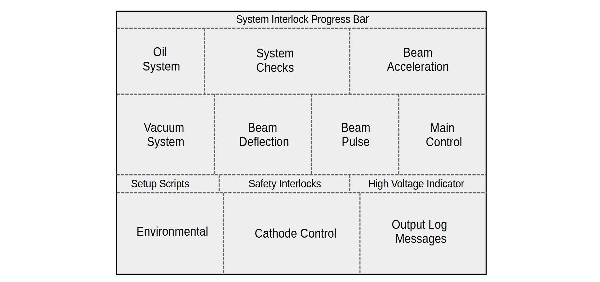
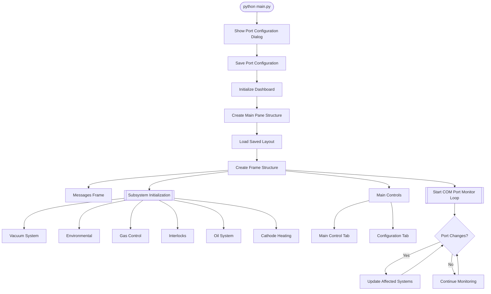

# EBEAM System Dashboard Software




### 1. Core Architecture and Flow

- **High-level Design**: The application is divided into several modules:
  - **main.py**: Entry point that initializes the COM port configuration and launches the dashboard
  - **dashboard.py**: Core dashboard class that sets up the main GUI layout and manages subsystems
  - **instrumentctl/**: Instrument-specific command libraries.
  - **subsystem/**: Contains classes and methods to manage individual hardware subsystems (e.g., VTRXSubsystem, EnvironmentalSubsystem).
  - **utils.py**: Utility functions and classes that support the main application (Logging, setup scripts, etc.).



### 2. Application Controls
| Shortcut  | Action | |
| ------------- | ------------- | ------------- |
| F1  | Help | Opens the keyboard shortcuts help window |
| F11  | Toggle Fullscreen | Switch between fullscreen and windowed mode |
| Escape  | Exit Fullscreen | Exit fullscreen mode |
| Ctrl + M  | Toggle Maximize | Switch between maximized and normal window size |
| Ctrl + S  | Help | Opens the keyboard shortcuts help window |
| Ctrl + Q | Quit | Close the application (with confirmation) |
| Ctrl + W | Quit (alternative) | Close the application (with confirmation) |

All of these shortcuts are supported across different operating systems.

### 3. Dashboard (dashboard.py)

- **EBEAMSystemDashboard Class**: The main class that sets up the dashboard interface.
  - Implements a flexible, configurable layout system using Tkinter's PanedWindow container widget.
  - Allows users to arrange and resize different control sections at run-time.
   - Each subsystem occupies its own configurable space

### 4. Subsystems

- **`vtrx/vtrx.py`**:
  - Manages the VTRX system, including serial communication and error handling.
  - Displays pressure data and switch states, updating the GUI in real-time.
  - Logs messages and errors to the messages frame.

- **`environmental/environmental.py`**:
  - Monitors and displays temperature data from various thermometers.

- **`interlocks/interlocks.py`**:
  - Monitors the status of various safety critical interlocks (e.g., Vacuum, Water, Door sensors).
  - Updates GUI indicators based on interlock status.

- **`oil_system/oil_system.py`**:
  - Monitors and displays oil temperature and pressure.

- **`cathode_heating/cathode_heating.py`**:
  - Manages three independent cathode heating channels
  - Power supply control interface
  - Real-time temperature plotting with overtemp indication

- **`visualization_gas_control.py`**:
  - Controls the Argon bleed system via serial communication.
  - TBD


### 5. Utilities (`utils.py`)

- **MessagesFrame Class**:
  - A custom Tkinter frame for displaying messages and errors.
  - Supports logging messages with timestamps and trimming old messages to maintain a maximum number of lines.

- **TextRedirector Class**:
  - Redirects stdout to a Tkinter Text widget.
  - Ensures that all print statements in the application are displayed in the messages frame.

- **SetupScripts Class**:
  - Manages the selection and execution of configuration scripts.
  - Provides a GUI for selecting scripts from a dropdown menu and executing them.

### 6. Directory Structure:
```
EBEAM_DASHBOARD/
├── README.md
├── __init__.py 
├── dashboard.py
├── instrumentctl/
│   ├── README.md
│   ├── __init__.py
│   ├── power_supply/
│   │   ├── README.md
│   │   └── power_supply_9014.py
│   ├── G9_driver/
│   │   ├── README.md
│   │   └── .py
│   └── E5CN_modbus/
│       ├── README.md
│       └── E5CN_modbus.py
├── main.py
├── subsystem/
│   ├── __init__.py
│   ├── cathode_heating/
│   │   ├── README.md
│   │   └── cathode_heating.py
│   ├── environmental/
│   │   ├── README.md
│   │   └── environmental.py
│   ├── interlocks/
│   │   ├── README.md
│   │   └── interlocks.py
│   ├── oil_system/
│   │   ├── README.md
│   │   └── oil_system.py
│   ├── visualization_gas_control/
│   │   ├── README.md
│   │   └── visualization_gas_control.py
│   └── vtrx/
│       ├── README.md
│       └── vtrx.py
└── utils.py
```

### 7. Development Workflow

#### Branching strategy
All code development intended to impact a future release is done on the latest `develop` branch. This applies to new instrument features, bug fixes, etc. The `develop` branch is **not stable**.
The `main` branch contains the latest production code.

#### Development Process 
Clone the repo to your machine.
```
git clone https://github.com/bwalkerMIR/EBEAM_dashboard.git
```
Navigate to your project directory:
```
cd EBEAM_dashboard
```
Create a virtual environment:
```
python -m venv venv
```
Activate the virtual environment (assuming on Windows)*:
```
venv\Scripts\activate
```
Install the requirements:
```
pip install -r requirements.txt
```
Run the main application:
```
python main.py
```

*Note: Due to the nature of the script, Windows may block execution, the following cmd is useful and should be run:
```
Set-ExecutionPolicy -ExecutionPolicy RemoteSigned -Scope CurrentUser
```

Create a new branch from develop for your feature or bug fix:

```
git checkout develop
git pull origin develop
git checkout -b feature/your-feature-name
```
Make your changes and commit:
```
git add changedfile.py
git commit -m "Descriptive commit message"
```

Push your branch to GitHub:
```
git push origin feature/your-feature-name
```

Create a "New pull request".
Set the base branch to develop and compare branch to your feature branch.
Fill in the PR template with a description of your changes, any related issues, and testing performed.

Assign reviewers to your PR. Merge.

### 6. Executable Build Instructions
```
python -m PyInstaller EBEAM_DASHBOARD.spec
```
