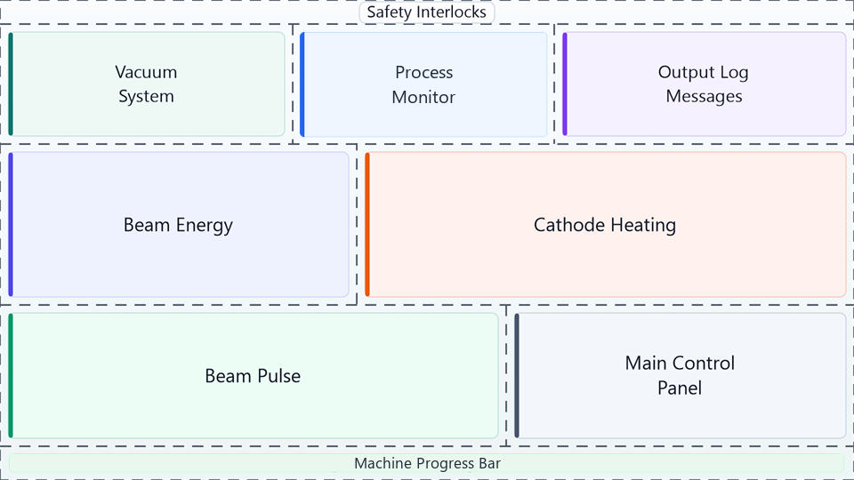
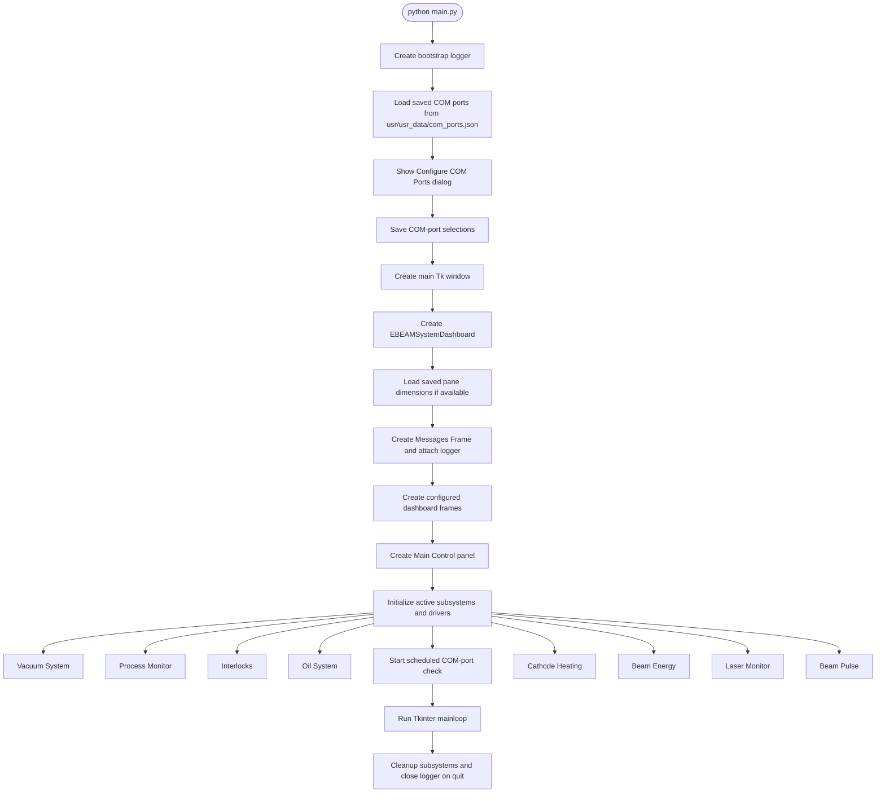

# EBEAM System Dashboard Software




## Core Architecture and Flow

- **High-level Design**: The application is divided into several modules:
  - **main.py**: Entry point that initializes the COM port configuration and launches the dashboard
  - **dashboard.py**: Core dashboard class that sets up the main GUI layout and manages subsystems
  - **instrumentctl/**: Instrument-specific command libraries.
  - **subsystem/**: Contains classes and methods to manage individual hardware subsystems (e.g., VTRXSubsystem, EnvironmentalSubsystem).
  - **utils.py**: Utility functions and classes that support the main application (Logging, setup scripts, etc.).


```mermaid
flowchart TD
    Start([python main.py]) --> Logger[Create bootstrap logger]
    Logger --> LoadPorts[Load saved COM ports from usr/usr_data/com_ports.json]
    LoadPorts --> PortDialog[Show Configure COM Ports dialog]
    PortDialog --> SavePorts[Save COM-port selections]
    SavePorts --> AppRoot[Create main Tk window]
    AppRoot --> InitDash[Create EBEAMSystemDashboard]

    InitDash --> Layout[Load saved pane dimensions if available]
    Layout --> Messages[Create Messages Frame and attach logger]
    Messages --> Frames[Create configured dashboard frames]
    Frames --> MainControl[Create Main Control panel]
    MainControl --> Subsystems[Initialize active subsystems and drivers]

    Subsystems --> Vacuum[Vacuum System]
    Subsystems --> Process[Process Monitor]
    Subsystems --> Interlocks[Interlocks]
    Subsystems --> Oil[Oil System]
    Subsystems --> Monitor[Start scheduled COM-port check]
    Subsystems --> Cathode[Cathode Heating]
    Subsystems --> BeamEnergy[Beam Energy]
    Subsystems --> Laser[Laser Monitor]
    Subsystems --> BeamPulse[Beam Pulse]

    Monitor --> TkLoop[Run Tkinter mainloop]
    TkLoop --> Cleanup[Cleanup subsystems and close logger on quit]
```

## Application Controls

| Shortcut | Action | Description |
| ------------- | ------------- | ------------- |
| `F1` | Help | Opens the keyboard shortcuts help window |
| `F11` | Toggle Fullscreen | Switch between fullscreen and windowed mode |
| `Escape` | Exit Fullscreen | Exit fullscreen mode |
| `Ctrl + M` | Toggle Maximize | Switch between maximized and normal window size |
| `Ctrl + S` | Help | Save Logs |
| `Ctrl + Q` | Quit | Close the application (with confirmation) |
| `Ctrl + W` | Quit (alternative) | Close the application (with confirmation) |

## Dashboard (dashboard.py)

- **EBEAMSystemDashboard Class**: The main class that sets up the dashboard interface.
  - Implements a flexible, configurable layout system using Tkinter's PanedWindow container widget.
  - Allows users to arrange and resize different control sections at run-time.
  - Each subsystem occupies its own configurable space

## Subsystems

- **`vtrx/vtrx.py`**:
  - Manages the VTRX system, including serial communication and error handling.
  - Displays pressure data and switch states, updating the GUI in real-time.
  - Logs messages and errors to the messages frame.

- **`interlocks/interlocks.py`**:
  - Monitors the status of various safety critical interlocks (e.g., Vacuum, Water, Door sensors).
  - Updates GUI indicators based on interlock status.

- **`oil_system/oil_system.py`**:
  - Currently just a placeholder frame

- **`cathode_heating/cathode_heating.py`**:
  - Manages three independent cathode heating channels
  - Power supply control interface
  - Real-time temperature plotting with overtemp indication

- **`process_monitor/process_monitor.py`**:
  - Monitors process temperatures through six DP16 process monitors in PMON.

- **`beam_energy/beam_energy.py`**:
  - Monitors and supervises high voltage power supplies through the Knob Box.

- **`beam_pulse/beam_pulse.py`**:
  - Provides the dashboard-facing control layer for the BCON beam pulse system.

- **`main_control/main_control.py`**:
  - Provides the operator-facing control panel for coordinated beam actions and configuration.

## Utilities (`utils.py`)

- **MessagesFrame Class**:
  - A custom Tkinter frame for displaying messages and errors.
  - Supports logging messages with timestamps and trimming old messages to maintain a maximum number of lines.

- **TextRedirector Class**:
  - Redirects stdout to a Tkinter Text widget.
  - Ensures that all print statements in the application are displayed in the messages frame.

- **SetupScripts Class**:
  - Manages the selection and execution of configuration scripts.
  - Provides a GUI for selecting scripts from a dropdown menu and executing them.

## Directory Structure

```text
EBEAM_dashboard/
├── README.md
├── main.py
├── dashboard.py
├── utils.py
├── subsystem/
│   ├── __init__.py
│   ├── beam_energy/
│   │   ├── README.md
│   │   └── beam_energy.py
│   ├── beam_pulse/
│   │   ├── README.md
│   │   └── beam_pulse.py
│   ├── cathode_heating/
│   │   ├── README.md
│   │   └── cathode_heating.py
│   ├── interlocks/
│   │   ├── README.md
│   │   └── interlocks.py
│   ├── main_control/
│   │   ├── __init__.py
│   │   ├── README.md
│   │   └── main_control.py
│   ├── process_monitor/
│   │   ├── README.md
│   │   └── process_monitor.py
│   └── vtrx/
│       ├── README.md
│       └── vtrx.py
└── instrumentctl/
    ├── __init__.py
    ├── BCON/
    │   ├── __init__.py
    │   ├── README.md
    │   └── bcon_driver.py
    ├── DP16_process_monitor/
    │   ├── README.md
    │   └── DP16_process_monitor.py
    ├── E5CN_modbus/
    │   ├── README.md
    │   └── E5CN_modbus.py
    ├── G9SP_interlock/
    │   ├── README.md
    │   ├── G9DriverFlowChart.png
    │   └── g9_driver.py
    ├── knob_box/
    │   ├── README.md
    │   ├── knob_box_modbus.py
    │   └── pymodbus_tester.py
    ├── laser_monitor/
    │   ├── __init__.py
    │   ├── README.md
    │   └── laser_monitor_driver.py
    └── power_supply_9104/
        ├── README.md
        ├── 9104_supply_port_hub.md
        └── power_supply_9104.py
```

## Configuration

Create a `.env` file in the project root with the following variables:

``` text
SUPABASE_API_URL=https://your-project-id.supabase.co
SUPABASE_API_KEY=your-api-key-here
```

## Development Workflow


## Branching strategy

All code development intended to impact a future release is done on the latest `develop` branch. This applies to new instrument features, bug fixes, etc. The `develop` branch is **not stable**.
The `main` branch contains the latest production code.

## Development Process 

Clone the repo to your machine. Current libraries require the use of Python version 3.11.

> Note: Python 3.11 is in the security-fix-only phase and is scheduled to reach End of Life (EOL) on 2027-10-31. The PSF support window for each major release is five years, typically split into bugfix and security phases. See https://devguide.python.org/versions/ and https://endoflife.date/python.

```
git clone https://github.com/uw-loci/EBEAM_dashboard.git
```
Navigate to your project directory:
```
cd EBEAM_dashboard
```
Create a virtual environment (dashboard currently requires python 3.11 due to dependencies):
```
py -3.11 -m venv .venv
```
Activate the virtual environment (assuming on Windows)*:
```
.\.venv\Scripts\Activate.ps1
```
Install the requirements:
```
python -m pip install --upgrade pip
pip install -r requirements.txt
```
Run the main application:
```
python main.py
```

*Note: Windows PowerShell may block script execution when activating the virtual environment. Before running `.\.venv\Scripts\Activate.ps1`, choose one of the following options:
```
Set-ExecutionPolicy -ExecutionPolicy RemoteSigned -Scope Process
```
Use this to allow scripts only in the current PowerShell session.

```
Set-ExecutionPolicy -ExecutionPolicy RemoteSigned -Scope CurrentUser
```
Use this to allow scripts for your user account in future PowerShell sessions.

Then activate the virtual environment:
```
.\.venv\Scripts\Activate.ps1
```

Create a new branch from develop for your feature or bug fix:

```
git checkout develop
git pull origin develop
git checkout -b feature/your-feature-name
```
Make your changes and commit:
```
git add changedfile.py
git commit -m "Descriptive commit message"
```

Push your branch to GitHub:
```
git push origin feature/your-feature-name
```

Create a "New pull request".
Set the base branch to develop and compare branch to your feature branch.
Fill in the PR template with a description of your changes, any related issues, and testing performed.

Assign reviewers to your PR. Merge.

## Executable Build Instructions

```
python -m PyInstaller EBEAM_DASHBOARD.spec
```

## Connectivity

If any USB ports are unplugged from the computer or I/O expander at any point, you will have to restart the computer before running the dashboard.
This is important when you are trying to figure out which COM port any given USB corresponds to.
This issue has been observed with PMON and Knob Box, but likely affects more CIs.
