# EBEAM_dashboard_LUT
Lookup Tables for EBEAM System GUI

## Dataset Origins

### Power Supply Lookup Tables
> **Note on the origin of the current Raw Data:**
> - The data for `raw_default.csv` was taken directly from handwritten measurements recorded during our experiment on July 11, 2025 (https://docs.google.com/spreadsheets/d/1T73CYgSkFAcI7QR085y3sOdtns9vNCIwv82ZkwADaoQ/edit?usp=sharing).
> - The raw data for `raw_A.csv`, `raw_B.csv`, and `raw_C.csv` were AI-generated to test lookup table functionality in the dashboard. These datasets were made intentionally different to allow for effective testing of switching between lookup tables.

### Beam Control Lookup Tables
> **Note on the origin of Beam Control Data:**
> - The raw beam control datasets were AI-generated to test beam control functionality developed in the `feature/BCON` branch.
> - These datasets provide calibration data for beam deflection and scan speed at different beam energies.
> - **Naming Convention (AI-generated):**
>   - **Filenames:** Format is `{type}_{energy}keV.csv` (e.g., `beam_deflection_20keV.csv`, `scan_speed_50keV.csv`)
>   - **Beam Deflection Files:** Columns are `current_amplitude_A` and `deflection_cm`
>   - **Scan Speed Files:** Columns are `frequency_hz` and `scan_speed_mps`
> - Energy values in filenames indicate the electron beam energy (in keV) for which the calibration is valid.

## Workflow for Updating Power Supply Lookup Tables

To update the power supply lookup tables and generate visualizations:

1. Replace your new raw CSV files in the `power_supply/raw_files/` directory.
   - Files must be named using the `raw_` prefix and `.csv` extension (for example: `raw_default.csv`, `raw_cathodeA.csv`).
   - Cleaned output filenames are created automatically by removing `raw_` (for example: `raw_cathodeA.csv` -> `cathodeA.csv`).
   - **Required columns:** Each raw file must have the following column headers (case-sensitive):
     - `beam_current`, `voltage`, `heater_current`
   - Example:
     | beam_current | voltage | heater_current |
     |--------------|---------|---------------|
     | 4.500        | 0.80    | 6.05          |
     | 4.620        | 0.80    | 6.04          |
     | 4.775        | 0.81    | 6.01          |
     | ...          | ...     | ...           |

2. Run the cleaning script:
   ```bash
   python clean.py --subsystem power_supply
   ```
    - The script processes all files in `power_supply/raw_files/` matching `raw_*.csv`, cleans and deduplicates the data, and writes results to `power_supply/` using the same filename with `raw_` removed.
   - For each cleaned dataset, two plots are generated:
     - Beam Current vs Voltage (X: voltage, Y: beam current)
     - Beam Current vs Heater Current (X: heater current, Y: beam current)
   - All plots are saved in the `power_supply/plots/` directory.

## Workflow for Updating Beam Control Lookup Tables

To update the beam control lookup tables and generate visualizations:

1. Replace your new raw CSV files in the `beam_control/raw_files/` directory.
   - Files must be named using the `raw_` prefix and `.csv` extension.
   - Cleaned output filenames are created automatically by removing `raw_`.
   - Existing beam-control plotting behavior expects names containing `bd` (beam deflection) or `ss` (scan speed), such as `raw_bd_20keV.csv` and `raw_ss_20keV.csv`.
   
   **Required columns by file type:**
   - **Beam Deflection files:** `current_amplitude_A`, `deflection_cm`
   - **Scan Speed files:** `frequency_hz`, `scan_speed_mps`

2. Run the cleaning script:
   ```bash
   python clean.py --subsystem beam_control
   ```
   - The script processes all files in `beam_control/raw_files/` matching `raw_*.csv` and writes results to `beam_control/` using the same filename with `raw_` removed.
   - For each dataset, a plot is generated showing the calibration curve.
   - All plots are saved in the `beam_control/plots/` directory.

## Running Cleanup Operations

From the repository root, run:
```bash
# Process power supply data
python data/lut/clean.py --subsystem power_supply

# Process beam control data
python data/lut/clean.py --subsystem beam_control

# Process all subsystems
python data/lut/clean.py --subsystem all
```

Or, from the `data/lut` directory, run:
```bash
python clean.py --subsystem power_supply
python clean.py --subsystem beam_control
python clean.py --subsystem all
```

## Example Output (Power Supply - Last Cleaning)

Below are the six graphs generated from the most recent power supply data cleaning:

> **Note:** If you are viewing this README on GitHub, the images and cleaned data shown reflect the last version that was pushed to the repository. For the most up-to-date results, check the `power_supply/plots/` directory and the cleaned CSV files after running `python clean.py`.

| Default: Beam Current vs Voltage | Default: Beam Current vs Heater Current |
|:-------------------------------:|:--------------------------------------:|
| 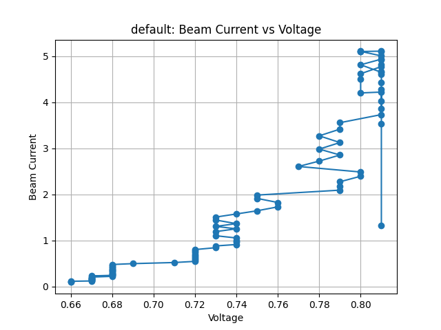 | 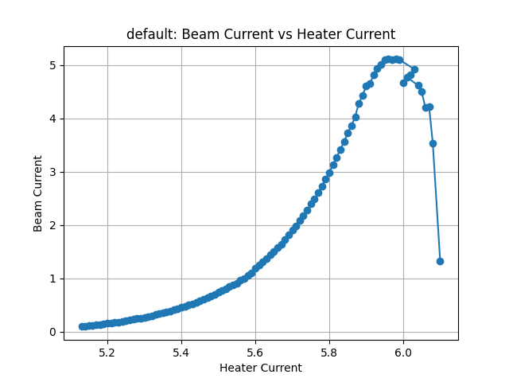 |

| PowerSupply A: Beam Current vs Voltage | PowerSupply A: Beam Current vs Heater Current |
|:--------------------------------------:|:---------------------------------------------:|
| 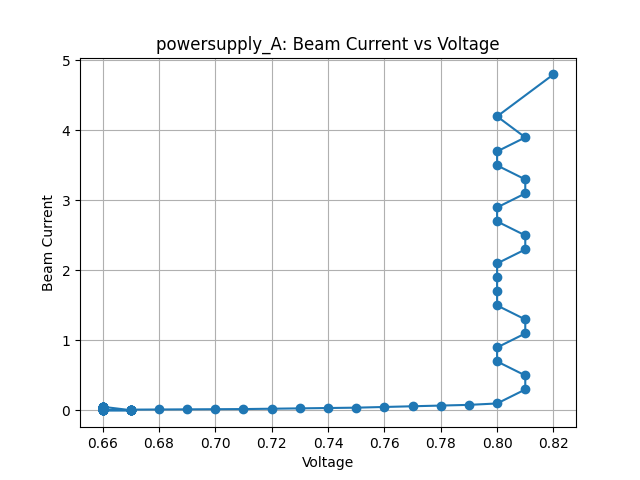 | 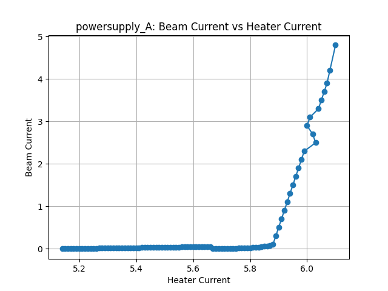 |

| PowerSupply B: Beam Current vs Voltage | PowerSupply B: Beam Current vs Heater Current |
|:--------------------------------------:|:---------------------------------------------:|
| 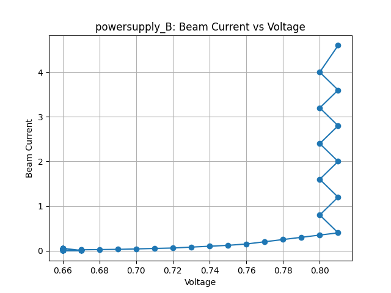 | 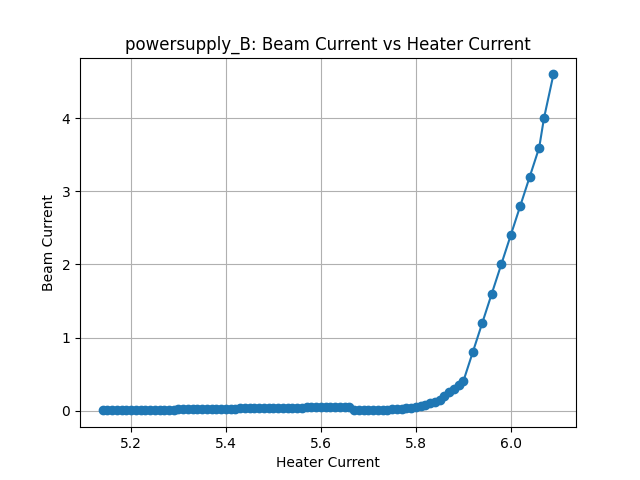 |

| PowerSupply C: Beam Current vs Voltage | PowerSupply C: Beam Current vs Heater Current |
|:--------------------------------------:|:---------------------------------------------:|
| 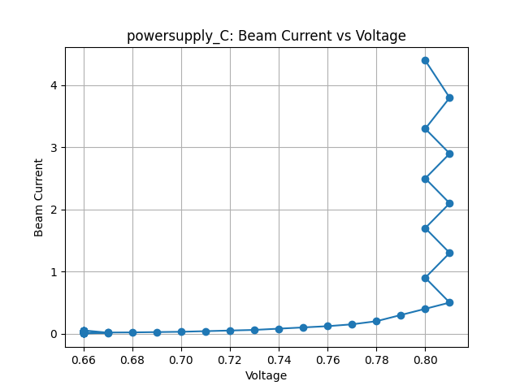 | 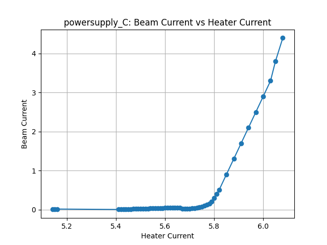 |

## Example Output (Beam Control - Last Cleaning)

Below are the four graphs generated from the most recent beam control data cleaning:

> **Note:** If you are viewing this README on GitHub, the images and cleaned data shown reflect the last version that was pushed to the repository. For the most up-to-date results, check the `beam_control/plots/` directory and the cleaned CSV files after running `python clean.py`.

| Beam Deflection at 20 keV | Beam Deflection at 50 keV |
|:-------------------------:|:-------------------------:|
| 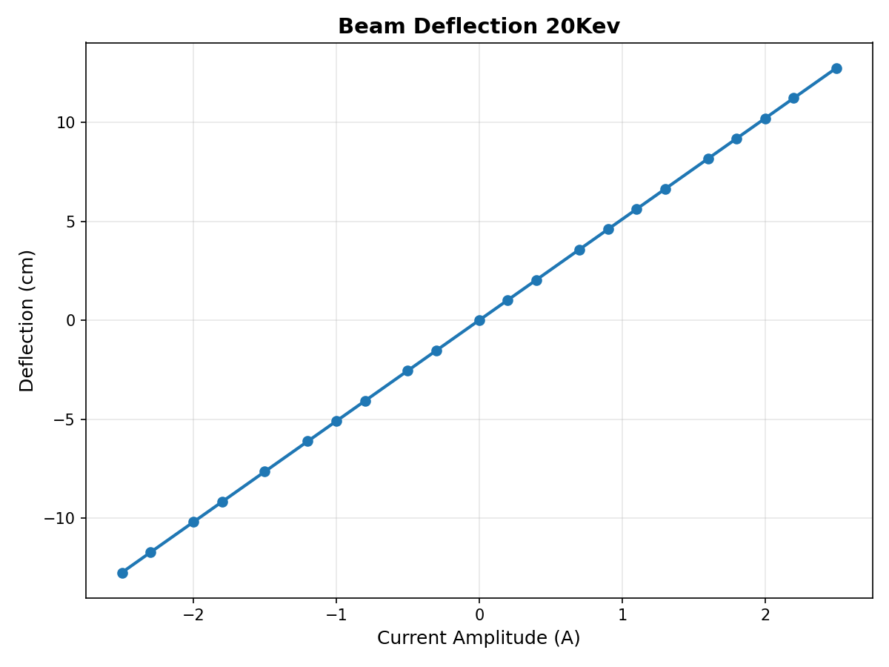 | 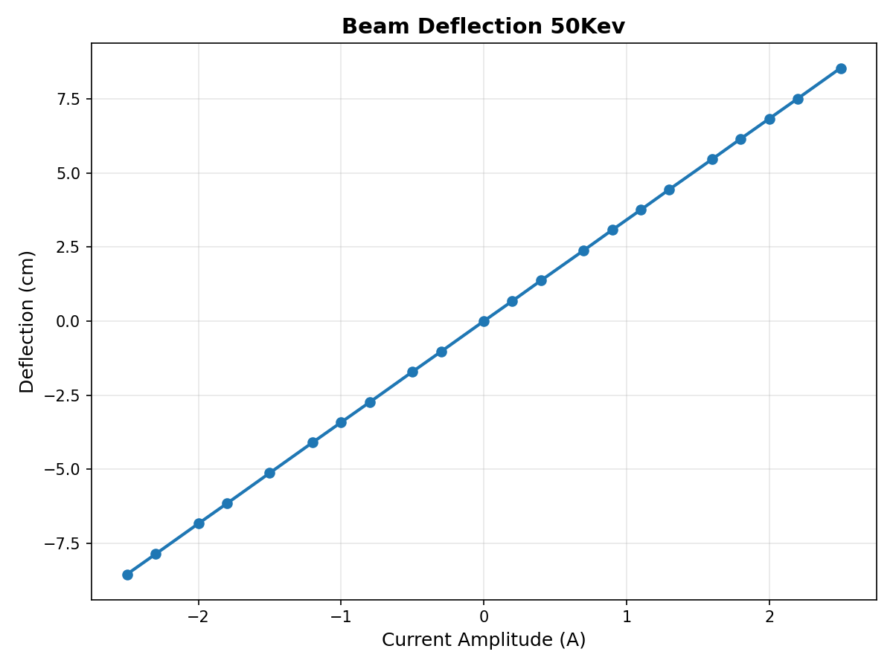 |

| Scan Speed at 20 keV | Scan Speed at 50 keV |
|:--------------------:|:--------------------:|
| 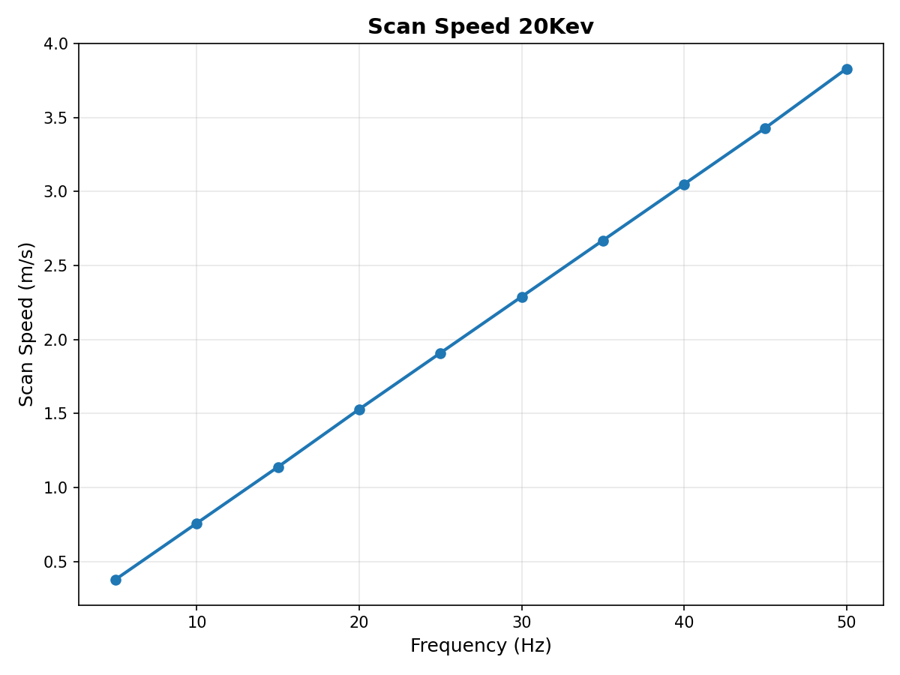 | 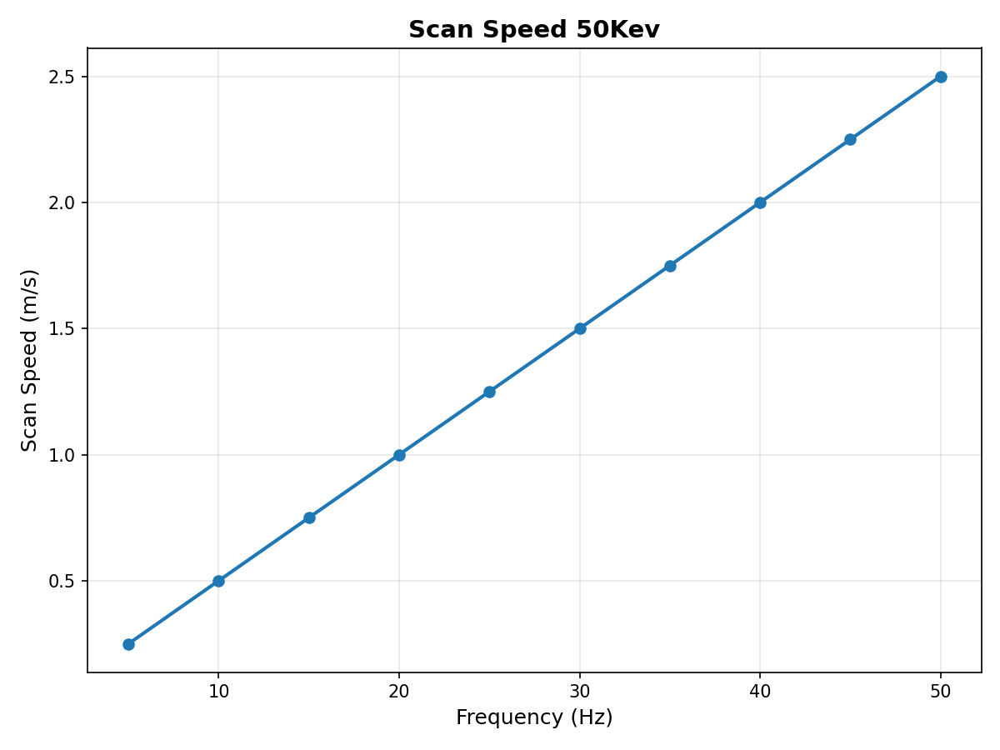 |


