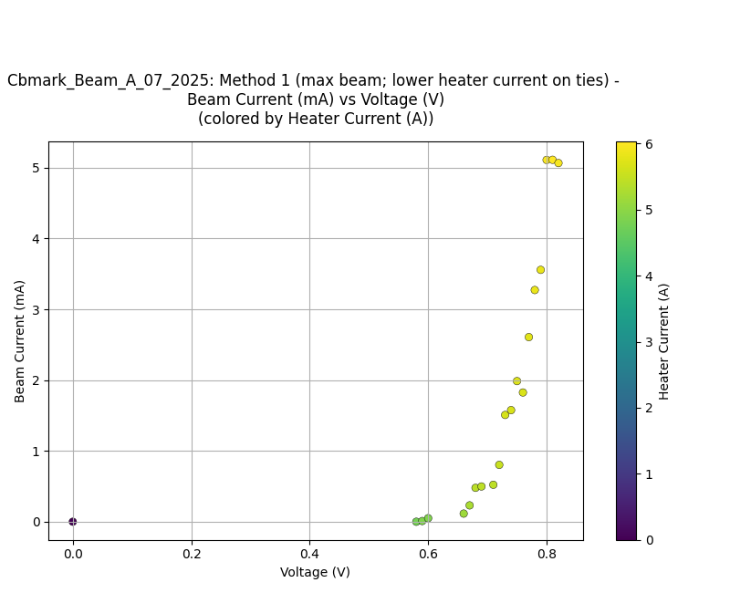
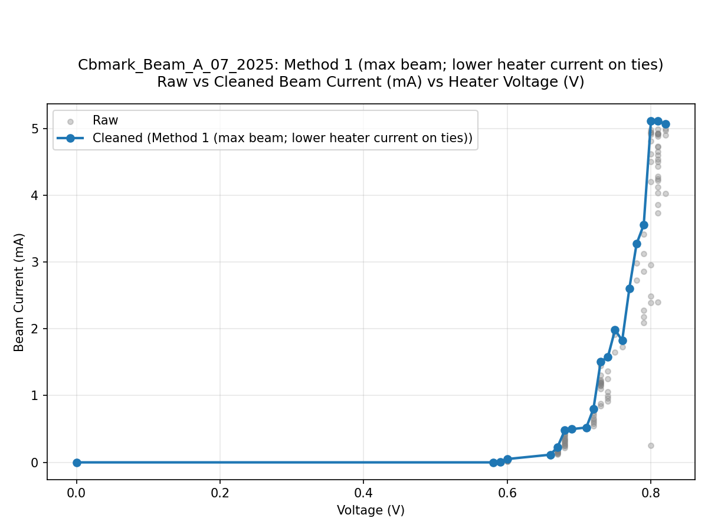
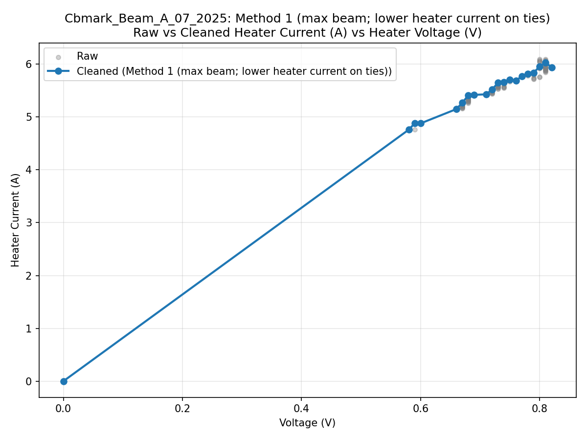
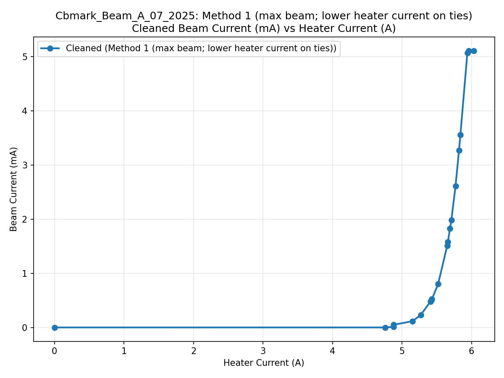

# EBEAM_dashboard_LUT
Lookup Tables for EBEAM System GUI

## Dataset Origins

### Power Supply Lookup Tables
> **Note on the origin of the current datasets:**
> - `Cbmark_Beam_A_07_2025.csv` was taken from the Google Sheet used during the July 11, 2025 experiment (https://docs.google.com/spreadsheets/d/1T73CYgSkFAcI7QR085y3sOdtns9vNCIwv82ZkwADaoQ/edit?usp=sharing).

## Workflow for Updating Power Supply Lookup Tables

To update the power supply lookup tables and generate visualizations:

1. Place or update CSV files directly in `power_supply/`.
   - **Required columns:** Each raw file must have the following column headers (case-sensitive):
     - `beam_current`, `voltage`, `heater_current`
   - Example:
     | beam_current | voltage | heater_current |
     |--------------|---------|---------------|
     | 4.500        | 0.80    | 6.05          |
     | 4.620        | 0.80    | 6.04          |
     | 4.775        | 0.81    | 6.01          |
     | ...          | ...     | ...           |

2. Run the cleaning script:
   ```bash
   python data/lut/clean.py data/lut/power_supply/Cbmark_Beam_A_07_2025.csv
   ```
   - The script cleans the specified file **in place** (overwrites the same CSV).
   - Power-supply cleaning uses a single rule per voltage bin:
     - Select the point with the **maximum beam current**.
     - If two or more points have the same beam current, select the one with the **lower heater current**.
   - For each cleaned dataset, output plots are generated in `power_supply/plots/`.
   - Graphs are saved only in the `power_supply/plots/` directory.

## Running Cleanup Operations

From the repository root, run:
```bash
# Clean one file (in place)
python data/lut/clean.py data/lut/power_supply/Cbmark_Beam_A_07_2025.csv

# Clean another file (in place)
python data/lut/clean.py data/lut/power_supply/Test_LUT_Dont_Use.csv
```

Or, from the `data/lut` directory, run:
```bash
python clean.py power_supply/Cbmark_Beam_A_07_2025.csv
python clean.py power_supply/Test_LUT_Dont_Use.csv
```

## Example Output (Power Supply - Method 1)

Below are the graphs generated for `Cbmark_Beam_A_07_2025.csv` using Method 1 (max beam current per voltage bin, lower heater current on ties):

> **Note:** If you are viewing this README on GitHub, the images and cleaned data shown reflect the last version that was pushed to the repository. For the most up-to-date results, check the `power_supply/plots/` directory and the cleaned CSV files after running `python clean.py`.

| Beam vs Voltage (colored by Heater) | Raw vs Clean Beam vs Voltage |
|:-----------------------------------:|:----------------------------:|
|  |  |

| Raw vs Clean Heater vs Voltage | Clean Beam vs Heater |
|:------------------------------:|:--------------------:|
|  |  |


