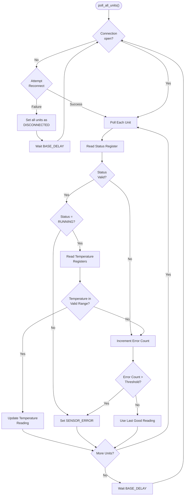

# DP16 Driver Documentation:


The DP16PT process monitors are used to extract important temperature readings from various locations of the experimental setup. The PMON system monitors 6 different temperature points to display real-time information related to the Solenoids, top and bottom of the vacuum chamber, and air temperature. Communication is established over a RS-485 bus using Modbus RTU protocol.


Libraries / Imports:


PyModbus (RS-485) - allows us to be able to send and receive packages in the standard Modbus (Master/Slave) communication protocol


Threading - crucial to make sure the driver does not hinder the performance of the driver is non-blocking of the GUI


LogLevel from utils - allows the ability for the driver to send errors or important information to the log for the user to see


### Hardware Specifications
- Manufacturer: Omega
- Model: DP16PT-330-C24
- Datasheet [(link)](https://www.farnell.com/datasheets/2339803.pdf)
- Communication protocol: Modbus RTU over RS485
- Resolution: 0.03 °C
- Reading Rate: 20 samples per second


### Serial Port Configuration
| Setting | Value |
|---------|-------|
| Baud rate | 9600 |
| Data bits | 8 |
| Parity | None |
| Stop bits | 1 |
| Slave Address | 1-6 (supports multiple units) |


### Basic Usage
```python
>>> from instrumentctl import DP16ProcessMonitor
>>>
>>> monitor = DP16ProcessMonitor(port='COM6', unit_numbers=[1, 2, 3, 4, 5, 6])
>>>
>>> temps = monitor.get_all_temperatures()
>>> print(temps)
>>> # Should output something like: {1: 23.5, 2: 24.1, 3: 23.8, 4: 22.9, 5: 25.2, 6: 23.7}
>>>
>>>
>>> monitor.disconnect()
```


### Modbus communication


0x03 - Read Holding Registers
The `DP16ProcessMonitor` calls to .read_holding_registers() method on a pyModbus SerialClient object to read out the contents of a contiguous block of registers in the remote hardware device.


```python
client.read_holding_registers(
    address=register_location,
    count=number_of_registers,
    slave=unit
)
```


0x04 - Read Input Registers
This code is used to read the input registers, which contain information regarding how the monitor is configured.


```python
client.read_input_registers(
    address=register_location,
    count=number_of_registers,
    slave=unit
)
```


0x10 - Write
This is used to write to mutable registers. This is used to write the process value decimal configuration.


```python
client.write_register(
        address=register_location,
        value=val,
        slave=unit
    )
```


### Package Structure


Modbus Request Format
| Byte Offset |  Size   | Description                          |
|-------------|-------------------------|--------------------------------------|
| +0          |  1 byte | Slave address                        |
| +1          |  1 byte | Function Code          |
| +2          |  1 byte | Register address       |
| optional    | N/a     | Writing data/Value |
| +3          |  2 byte |  CRC         |


Modbus Response Format
| Byte Offset |  Size   | Description                          |
|-------------|-------------------------|--------------------------------------|
| +0          |  1 byte | Slave address                        |
| +1          |  1 byte | Function Code          |
| +2          |  1 byte | Number Of Bytes       |
| optional    | N/a     | Data/Value |
| +4          |  2 byte |  CRC         |


### Interactions with Registers


On start-up we write to register 0x0248 (the READING_CONFIG), to verify the decimal format. Following this, we write to the STATUS register at 0x0240 to make sure the monitor is in run mode.


Two registers are polled repeatedly during Normal Operation:


Firstly, we read what the STATUS register is, receiving a 0x0006 indicates that the monitor is in the running state and has not incurred any errors. If an error has occurred, such as a loss of connection with the sensor, the monitor will switch to the operating state, this is indicated with receiving a 0x000A. If this is the case this information is sent to the frontend and is indicated with an orange bar.


After checking the STATUS register, we check the PROCCESS_VAL register. Which we have one of two outcomes, either the package is received and the information is sent to the frontend to update the thermometer, or the package is not received and will have to wait till the next clock cycle to retrieve the temperature data.

### Flowcharts




