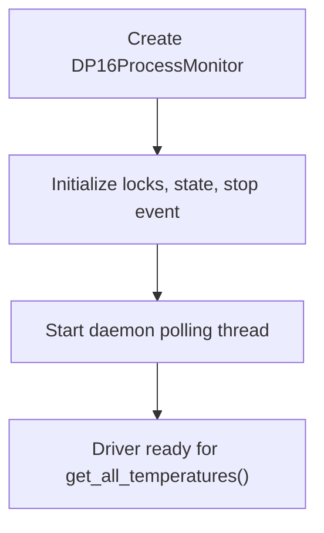
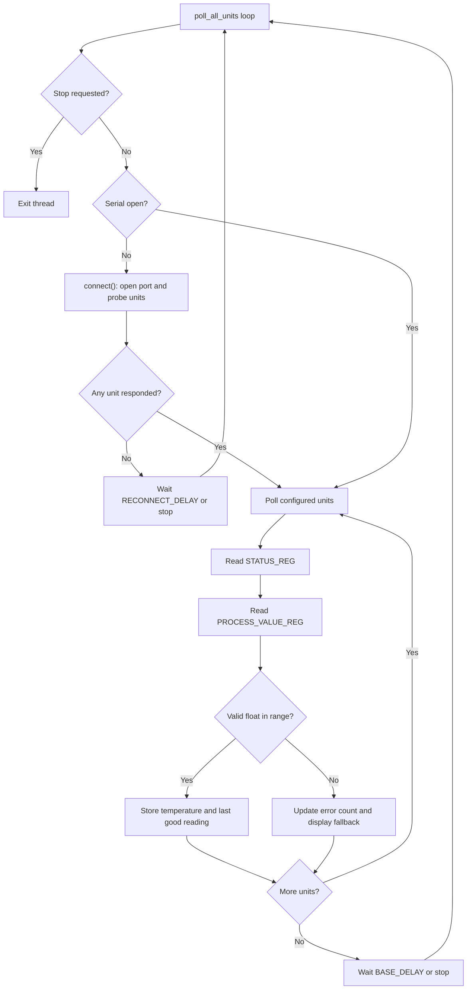

# DP16 Process Monitor Driver

`DP16ProcessMonitor` is the RS-485 / Modbus RTU driver for Omega iSeries
DP16PT process monitors. It polls multiple slave units in a background thread
and exposes the latest temperature values to the dashboard through a
thread-safe snapshot API.

The current implementation uses raw `pyserial` frames instead of PyModbus. It
builds Modbus RTU requests directly, appends CRC-16 checksums, strips optional
local echo from USB/RS-485 adapters, validates response CRCs, and parses the
returned registers.

## Dependencies

- `pyserial` for serial port access.
- `threading` and `queue` from the Python standard library for polling,
  shutdown signaling, locks, and background-thread log forwarding.
- `LogLevel` from `utils.py` for dashboard-compatible logging.

## Hardware

| Setting | Value |
|---------|-------|
| Manufacturer | Omega |
| Model | DP16PT-330-C24 |
| Protocol | Modbus RTU over RS-485 |
| Baud rate | 9600 |
| Data bits | 8 |
| Parity | None |
| Stop bits | 1 |
| Default units | 1, 2, 3, 4, 5 |
| Dashboard units | 1 through 6 |

## Register Map

| Constant | Address | Purpose |
|----------|---------|---------|
| `PROCESS_VALUE_REG` | `0x0210` | Floating point process temperature, read as two holding registers |
| `STATUS_REG` | `0x0240` | Device status |
| `RDGCNF_REG` | `0x0248` | Reading configuration |

Important values:

| Constant | Value | Meaning |
|----------|-------|---------|
| `STATUS_RUNNING` | `0x0006` | Expected running state |
| `DISCONNECTED` | `-1` | Driver-level disconnected state for UI display |
| `SENSOR_ERROR` | `-2` | Driver-level sensor/error state for UI display |

## Basic Usage

```python
from instrumentctl import DP16ProcessMonitor

monitor = DP16ProcessMonitor(
    port="COM6",
    unit_numbers=[1, 2, 3, 4, 5, 6],
)

temps = monitor.get_all_temperatures()
print(temps)
# Example: {1: 23.5, 2: 24.1, 3: -1, 4: 22.9, 5: 25.2, 6: -2}

monitor.disconnect()
```

`close()` is also available as a compatibility alias for `disconnect()`.

## Public API

| Method | Description |
|--------|-------------|
| `connect()` | Opens the serial port if needed and probes the configured units. Returns `True` if at least one unit responds. The polling thread calls this automatically when disconnected. |
| `get_all_temperatures()` | Returns a thread-safe copy of the latest `{unit: value}` dictionary. Also flushes queued background logs when called from the main thread. |
| `get_reading_config(unit)` | Reads `RDGCNF_REG` for one unit. Returns the register value or `None` on error. |
| `disconnect()` | Requests the polling thread to stop, marks readings disconnected, joins the worker with a timeout, and closes the serial port. |
| `close()` | Alias for `disconnect()`. |

`_set_config(unit)` exists as an internal helper for writing `RDGCNF_REG` and
`STATUS_REG`, but the driver does not automatically call it during
initialization.

## Polling Behavior

Creating `DP16ProcessMonitor` immediately starts one daemon polling thread.
The loop:

1. Checks whether the serial port is open.
2. Attempts reconnect if the port is closed.
3. Polls each configured unit in address order.
4. Reads `STATUS_REG`.
5. Reads `PROCESS_VALUE_REG` as two holding registers.
6. Interprets the two registers as a big-endian IEEE-754 float.
7. Validates that the value is nonzero and within `MIN_TEMP` to `MAX_TEMP`.
8. Updates `temperature_readings` and `last_good_readings`.

On transient per-unit errors, the driver keeps showing the last known good
reading when one exists. After `ERROR_THRESHOLD` consecutive errors for a unit,
that unit is marked `DISCONNECTED`. If no good reading has ever been seen, the
unit is marked `SENSOR_ERROR` until the threshold is reached.

## Timing

| Constant | Value | Purpose |
|----------|-------|---------|
| `SERIAL_READ_TIMEOUT` | `0.02 s` | pyserial read timeout |
| `SERIAL_INTER_BYTE_TIMEOUT` | `0.02 s` | pyserial inter-byte timeout |
| `WRITE_TIMEOUT` | `1.0 s` | pyserial write timeout |
| `TRANSACTION_TIMEOUT` | `0.75 s` | total Modbus transaction wait |
| `INTERFRAME_DELAY` | `0.005 s` | quiet interval before each RTU frame |
| `BETWEEN_UNIT_DELAY` | `0.1 s` | delay between unit polls |
| `BASE_DELAY` | `0.1 s` | delay between polling passes after successful communication |
| `RECONNECT_DELAY` | `1.0 s` | delay between reconnect attempts |
| `THREAD_JOIN_TIMEOUT` | `2.0 s` | maximum wait for polling thread shutdown |
| `SERIAL_CLOSE_LOCK_TIMEOUT` | `0.5 s` | maximum wait to acquire the serial lock during shutdown |

All sleeps in the polling path use the stop event, so shutdown can interrupt
normal wait periods quickly.

## Thread Safety

The driver is designed for one background polling thread plus foreground GUI
calls.

| Shared resource | Protection |
|-----------------|------------|
| Serial port / Modbus transactions | `modbus_lock` |
| Temperature readings and last good readings | `response_lock` |
| Shutdown state | `threading.Event` |
| Background-thread logs | `queue.SimpleQueue` flushed from the main thread |

`disconnect()` sets the stop event, marks all readings as `DISCONNECTED`, tries
to close the serial port, joins the polling thread with a timeout, and logs a
warning if the worker did not stop in time.

## Modbus RTU Frames

Read holding register request, function `0x03`:

| Byte(s) | Description |
|---------|-------------|
| 0 | Slave address |
| 1 | Function code `0x03` |
| 2-3 | Register address, big-endian |
| 4-5 | Register count, big-endian |
| 6-7 | CRC-16, little-endian |

Write single register request, function `0x06`:

| Byte(s) | Description |
|---------|-------------|
| 0 | Slave address |
| 1 | Function code `0x06` |
| 2-3 | Register address, big-endian |
| 4-5 | Register value, big-endian |
| 6-7 | CRC-16, little-endian |

Normal read response:

| Byte(s) | Description |
|---------|-------------|
| 0 | Slave address |
| 1 | Function code |
| 2 | Byte count |
| 3..N | Register data |
| Last 2 | CRC-16, little-endian |

Exception responses use `function | 0x80` and include a Modbus exception code.

## Flow


```mermaid
flowchart TB
    Init["Create DP16ProcessMonitor"] --> State["Initialize locks, state, stop event"]
    State --> Thread["Start daemon polling thread"]
    Thread --> Ready["Driver ready for get_all_temperatures()"]
```


```mermaid
flowchart TB
    Loop["poll_all_units loop"] --> Stop{"Stop requested?"}
    Stop -->|Yes| Exit["Exit thread"]
    Stop -->|No| Open{"Serial open?"}
    Open -->|No| Reconnect["connect(): open port and probe units"]
    Reconnect --> Connected{"Any unit responded?"}
    Connected -->|No| WaitReconnect["Wait RECONNECT_DELAY or stop"]
    WaitReconnect --> Loop
    Connected -->|Yes| PollUnits["Poll configured units"]
    Open -->|Yes| PollUnits
    PollUnits --> Status["Read STATUS_REG"]
    Status --> Temp["Read PROCESS_VALUE_REG"]
    Temp --> Validate{"Valid float in range?"}
    Validate -->|Yes| Store["Store temperature and last good reading"]
    Validate -->|No| Error["Update error count and display fallback"]
    Store --> Next{"More units?"}
    Error --> Next
    Next -->|Yes| PollUnits
    Next -->|No| WaitBase["Wait BASE_DELAY or stop"]
    WaitBase --> Loop
```
