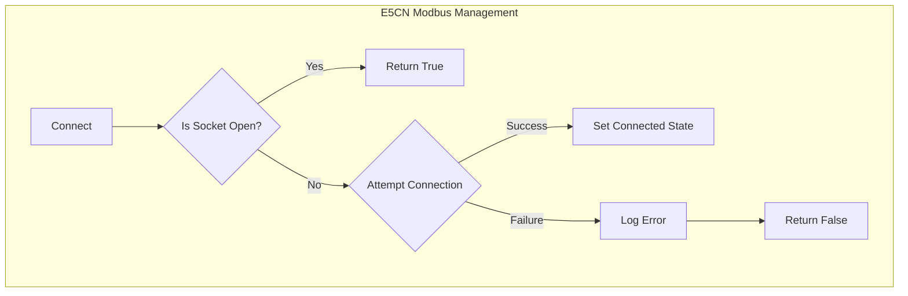
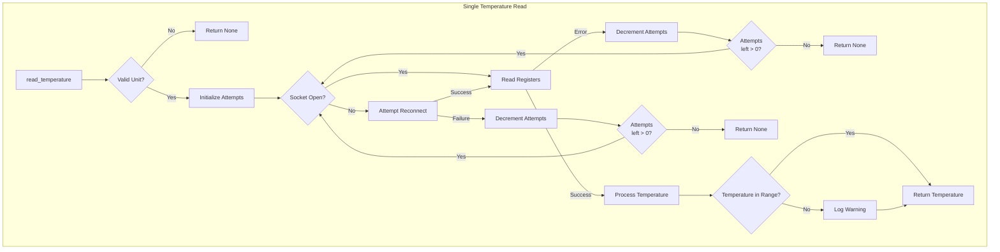
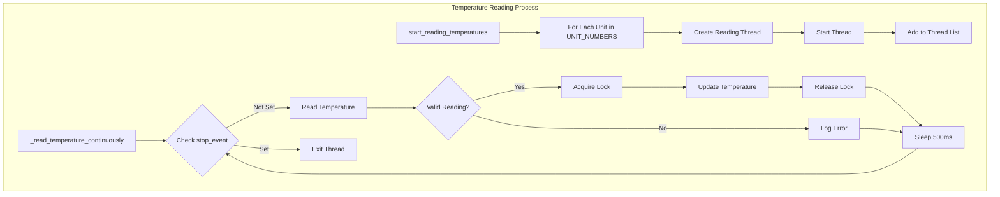

# E5CN Temperature Controller Driver Documentation

### Hardware Specifications
- Manufacturer: Omron
- Model: E5CN-HV2M-500
- Datasheet [(link)](https://mm.digikey.com/Volume0/opasdata/d220001/medias/docus/518/E5CN-H.pdf)
- Communication interface: Modbus RTU over RS485
- Resolution: 0.01 °C
- Sampling cycle: 60 ms

### Serial Port Configuration Settings
| Setting | Value |
|---------|-------|
| Baud rate | 9600 |
| Data bits | 8 |
| Parity | Even |
| Stop bits | 2 |
| Slave Address | 1-3 (supports multiple units) |

### Basic Usage

```python
>>> from instrumentctl import E5CNModbus

# Initialize controller with default settings
>>> controller = E5CNModbus(port="COM4")

# Connect to the device
>>> controller.connect()
True

# Read temperature from a single unit
>>> temp = controller.read_temperature(unit=1)
>>> print(f"Temperature: {temp}°C")
Temperature: 23.5°C

# Clean up
>>> controller.disconnect()
```

### Flowcharts




