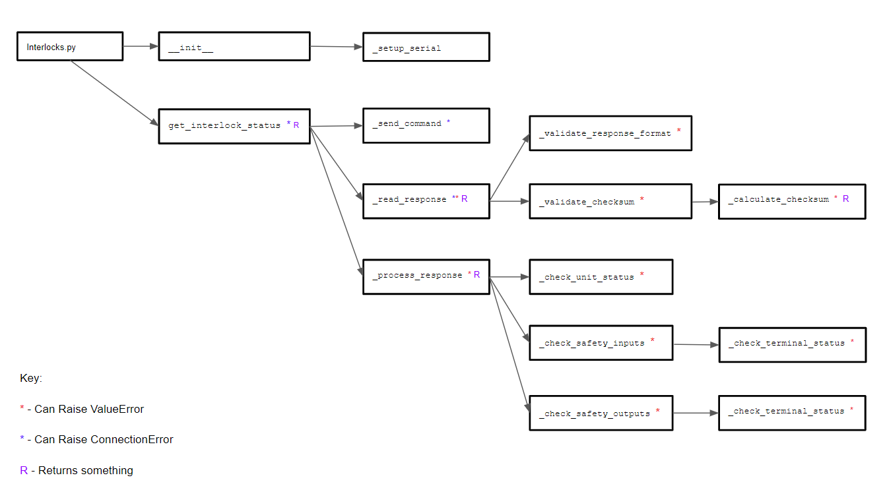
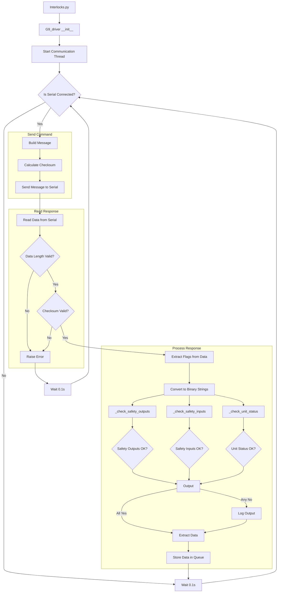

# G9 Driver Documentation:


## Purpose and functionality:


The OMRON G9SP is the safety controller being used for the safety system to analyze the input from the machine along with controlling the High voltage(HVOLT) for the printer.
This driver is made to be able to communicate through a serial connection to the G9SP to pull and update the GUI on the current status of the interlocks, along will handle and present the user with any current errors that the G9SP is experiencing.


Libraries / Imports:


PySerial (serial) - allows us to be able to send and receive data through the serial port on the G9 and the driver


LogLevel from utils - allows the ability for the driver to send errors or important information to the log for the user to see


## Communications:


### Serial Port:


The OMRON G9SP uses a proprietary pin lay out for serial communications:


**OMRON Standard**


| Pin | Abbr.   | Signal                | Signal Direction |
|-----|---------|-----------------------|------------------|
| 1   | FG      | Frame ground          | ---             |
| 2   | SD (TXD)| Send data             | Outputs         |
| 3   | RD (RXD)| Receive data          | Inputs          |
| 4   | RS (RTS)| Request to send       | Outputs         |
| 5   | CS (CTS)| Clear to send         | Inputs          |
| 6   | 5 V     | Power                 | ---             |
| 7   | DR (DSR)| Data set ready        | Inputs          |
| 8   | ER (DTR)| Data terminal ready   | Outputs         |
| 9   | SG (0 V)| Signal ground         | ---             |
| Connector hood | FG | Frame ground    | ---             |


Compared to the Standard


**RS232 Standard**


| Pin | Signal Name | Abbreviation | Direction |
|-----|-------------|--------------|-----------|
| 1   | Carrier Detect | CD       | Input     |
| 2   | Receive Data   | RD (RXD) | Input     |
| 3   | Transmit Data  | TD (TXD) | Output    |
| 4   | Data Terminal Ready | DTR | Output    |
| 5   | Signal Ground  | SG       | ---       |
| 6   | Data Set Ready | DSR      | Input     |
| 7   | Request to Send | RTS     | Output    |
| 8   | Clear to Send  | CTS      | Input     |
| 9   | Ring Indicator | RI       | Input     |


So the needed cable requires these connections to translate the OMRON Standard -> R232 Standard


| OMRON Pin | RS-232 Pin | Description                                                             |
|-----------|------------|-------------------------------------------------------------------------|
| 1         | 1          | Both connections need to be shielded                                   |
| 2         | 3          | Connects OMRON's Send Data (TXD) to RS-232's Send Data (TXD)           |
| 3         | 2          | Connects OMRON's Receive Data (RXD) to RS-232's Receive Data (RXD)     |
| 4 -> 5    | ---        | Jumps OMRON's Request to Send (RTS) to Clear to Send (CTS) (required)  |
| ---       | 7 -> 8     | Jumps RS-232's Request to Send (RTS) to Clear to Send (CTS) (optional) |
| 9         | 9          | Signal Ground to Signal Ground                                         |


**Pyserial Configuration**


For the Pyserial port to effectively communicate with the safety controller, the following arguments are required when defining the serial object:


| Argument  | Value                                                                                 |
|-----------|---------------------------------------------------------------------------------------|
| Port      | The port that the serial connection is using on the driver side (e.g., COM##)        |
| Baudrate  | 9600 or 115200 bps (depends on the 3rd DIP switch setting on the controller)         |
| Parity    | Needs to be set to "even"                                                            |
| Stop Bits | 1 bit                                                                                |
| Byte Size | 8 bits                                                                               |
| Timeout   | 300 ms (the G9SP controller is expected to respond within 300 ms)                    |


With this configuration the commands write and read are used for communications:


```python
serial_connection.write(data: bytes) -> int


serial_connection.read(size: int) -> bytes


serial_connection.read_until(data: bytes) -> bytes
```


### Packages:


#### From Driver to G9SP:


| Byte Offset | Value          | Size  | Description                       |
|-------------|----------------|-------|-----------------------------------|
| +0          |  `0x40`   | 1 byte | Fixed value                           |
| +1          |  `0x00`   | 1 byte | Fixed value                           |
| +2          |  `0x00`   | 1 byte | Fixed value                           |
| +3          |  `0x0F`   | 1 byte | Fixed value                           |
| +4          |  `0x4B`   | 1 byte | Fixed value                           |
| +5          |  `0x03`   | 1 byte | Fixed value                           |
| +6          |  `0x4D`   | 1 byte | Fixed value                           |
| +7          |  `0x00`   | 1 byte | Fixed value                           |
| +8          |  `0x01`   | 1 byte | Fixed value                           |
| +9          | Data           | 6 bytes | Data payload                    |
| +15         | Checksum (H)   | 1 byte | High byte of the checksum        |
| +16         | Checksum (L)   | 1 byte | Low byte of the checksum         |
| +17         |  `0x2A`   | 1 byte | Fixed value                           |
| +18         |  `0x0D`   | 1 byte | Fixed value                           |


For our driver the implementation for the Data section of the safety controller was not needed. To be able to request the Optional Communication data, when programmed in the controller, this functionality will need to be added.


The checksum requires the summation of bytes from byte 0 to 14 (inclusive), storing the most significant values in Checksum (H) and the least Significant bytes in Checksum (L). Thus without the use of the data section the checksum should always be python ``` b"\x00\xEB" ```.


#### From G9SP to Driver:


| Byte Offset | Value           | Size   | Description                          |
|-------------|-----------------|--------|--------------------------------------|
| +0          | `0x40`          | 1 byte | Fixed value                          |
| +1          | Response length (HL): `0x00` | 1 byte | High byte of response length         |
| +2          | Response length (LH): `0x00` | 1 byte | Low byte of response length          |
| +3          | Response length (LL)         | 1 byte | Actual length of the response        |
| +4          | End code (H)                 | 2 bytes | High byte of the end code            |
| +5          | End code (L)                 | 2 bytes | Low byte of the end code             |
| +6          | Service code                 | 1 byte  | Indicates the type of response       |
| +7          | Data                         | 188 bytes | Main data payload                    |
| +195        | Checksum (H)                 | 1 byte  | High byte of checksum                |
| +196        | Checksum (L)                 | 1 byte  | Low byte of checksum                 |
| +197        | `0x2A`                       | 1 byte  | Fixed value                          |
| +198        | `0x0D`                       | 1 byte  | Fixed value                          |


---


| Response Length (LL)         | Description               | Rest of Message                                                                                  |
|------------------------------|---------------------------|--------------------------------------------------------------------------------------------------|
| Normal response              | `0xC3`                    | End Code: `0x0000` <br> Service Code: `0xCB` <br> Data Section: Refer to detailed Data Section below |
| Error response               | `0x09`                    | End Code: `0x0000` <br> Service Code: `0x94` <br> Data Section: Contains 2 bytes of reserved data |
| Incorrect command format     | `0x06`                    | End Code: `0x0000` <br> Service Code: Not included in response <br> Data Section: Not included in response |


Checksum same as above, summation of bytes 0 to 194 (inclusive).


### Parsing response Package:


**Data Section**


| Offset | Name                                  | Size    | Description                                |
|--------|---------------------------------------|---------|--------------------------------------------|
| +0     | Optional Communications Transmission Data | 4 bytes | Data related to optional communications.   |
| +4     | Safety Input Terminal Data Flags      | 6 bytes | Flags indicating safety input terminal data status. |
| +10    | Safety Output Terminal Data Flags     | 4 bytes | Flags indicating safety output terminal data status. |
| +14    | Safety Input Terminal Status Flags    | 6 bytes | Flags for current status of safety input terminals. |
| +20    | Safety Output Terminal Status Flags   | 4 bytes | Flags for current status of safety output terminals. |
| +24    | Safety Input Terminal Error Causes    | 24 bytes | Error causes for safety input terminals.   |
| +48    | Safety Output Terminal Error Causes   | 16 bytes | Error causes for safety output terminals.  |
| +64    | Reserved                              | 2 bytes | Reserved for future use.                   |
| +66    | Unit Status                           | 2 bytes | Overall status of the G9SP unit.           |
| +68    | Configuration ID                      | 2 bytes | ID for the current configuration.          |
| +70    | Unit Conduction Time                  | 4 bytes | Time since the unit started conducting.    |
| +74    | Reserved                              | 20 bytes| Reserved for future use.                   |
| +94    | Present Error Information             | 12 bytes | Information on current errors.             |
| +106   | Error Log Count                       | 1 byte  | Number of entries in the error log.        |
| +107   | Operation Log Count                   | 1 byte  | Number of entries in the operation log.    |
| +108   | Error Log                             | 40 bytes | Detailed log of recent errors.             |
| +148   | Operation Log                         | 40 bytes | Detailed log of recent operations.         |


### Inputs / Outputs:
The OMRON G9SP controller is able to be configured to have a total of 20 inputs and 16 outputs. This is important to consider when parsing the response data because not considering these constraints given the data would lead to parsing the reserve sections which would lead to undefined behavior.


### Data Flags
Each input or output receives one bit:

| Value (Binary) | Meaning                                     |
|----------------|---------------------------------------------| 
| 0b0            | Terminal OFF (or error for inputs)          |
| 0b1            | Terminal ON                                 |

### Status Flags
Each input or output receives one bit:

| Value (Binary) | Meaning                          |
|----------------|----------------------------------| 
| 0b0            | Error                            |
| 0b1            | Normal operation (no error)      |

Errors in this section are caused by disconnected lines, ground faults, or short circuits. The specific cause of the error is detailed in the **Error Causes** sections below.

### Error Causes

#### Inputs

Each input is assigned a nibble (4 bits) to indicate the cause of an error. The table below lists the hexadecimal representation of the nibble and the corresponding error meaning.

| Value (Hex) | Meaning                             |
|-------------|-------------------------------------| 
| 0x0         | No error                            |
| 0x1         | Invalid configuration               |
| 0x2         | External test signal failure        |
| 0x3         | Internal circuit error              |
| 0x4         | Discrepancy error                   |
| 0x5         | Failure of the associated dual-channel input |

#### Outputs

Each output is assigned a nibble (4 bits) to indicate the cause of an error. The table below lists the hexadecimal representation of the nibble and the corresponding error meaning.

| Value (Hex) | Meaning                                |
|-------------|----------------------------------------| 
| 0x0         | No error                               |
| 0x1         | Invalid configuration                  |
| 0x2         | Overcurrent detection                  |
| 0x3         | Short circuit detection                |
| 0x4         | Stuck-at-high detection                |
| 0x5         | Failure of the associated dual-channel output |
| 0x6         | Internal circuit error                 |
| 0x8         | Dual channel violation                 |

### Unit Status

The Unit Status section of the package has 2 bytes, of which contain 4 flags that indicate the overall status of the controller. The rest of the bits are reserved.

| Bit Position | Description                    | Meaning                                                                                  |
|--------------|--------------------------------|------------------------------------------------------------------------------------------|
| 0            | Unit Normal Operation Flag     | 0 : Error occurred or program stopped <br> 1 : Normal status                             |
| 9            | Output Power Supply Error Flag | 0 : Output power supply voltage normal <br> 1 : Output power supply voltage error or OFF |
| 10           | Safety I/O Terminal Error Flag | 0 : No error in Safety I/O terminals <br> 1 : Error in Safety I/O terminals              |
| 13           | Function Block Error Flag      | 0 : No error in any function block <br> 1 : Error in a function block                    |


### Code Flow Diagram for `g9_driver.py`



https://tinyurl.com/mr2wudtv (Updated 11/5)

### Flowchart



