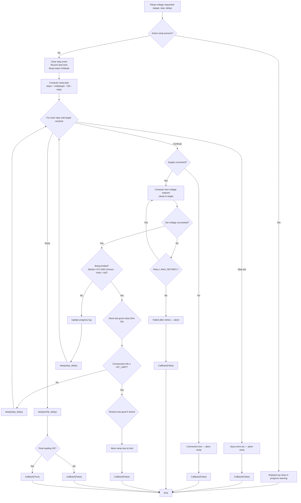

# 9104 Power Supply Driver Documentation

### Hardware Specifications
- Manufacturer: BK Precision
- Model: 9104 Series 320W Multi Range DC Power Supply
- Firmware version: 1.30
- User manual: [(link)](https://bkpmedia.s3.us-west-1.amazonaws.com/downloads/manuals/en-us/9103_9104_manual.pdf)
- Datasheet [(link)](https://www.mouser.com/datasheet/2/43/9103_9104_series_datasheet-1131399.pdf)
- Communication interface: UART over RS485
- Programming manual: [(link)](https://bkpmedia.s3.us-west-1.amazonaws.com/downloads/programming_manuals/en-us/9103_9104_programming_manual.pdf)

### Serial Port Configuration Settings
| Setting | Value |
|---------|-------|
| Baud rate | 9600 |
| Data bits | 8 |
| Parity | None |
| Stop bits | 1 |
| Flow control | None |

### Basic Usage

```python
# Initialize the power supply
>>> ps = PowerSupply9104(port="COM3", baudrate=9600)

# Check connection
>>> ps.is_connected()
True

# Set to preset mode 3 (normal operation)
>>> ps.set_preset_selection(3)
True

# Configure protection limits
>>> ps.set_over_voltage_protection(2.0)  # 2V OVP limit
True
>>> ps.set_over_current_protection(8.5)   # 8.5A OCP limit
True

# Set voltage and current for preset 3
>>> ps.set_voltage(3, 1.0)  # Set to 1V
True
>>> ps.set_current(3, 1.0)  # Set to 1A
True

# Verify settings
>>> ps.get_settings(3)
(1.0, 1.0)  # Returns (voltage, current)

# Turn output on
>>> ps.set_output(1)
True

# Read current measurements
>>> ps.get_voltage_current_mode()
(1.02, 0.98, 'CV Mode')  # Returns (voltage, current, mode)

# Turn output off
>>> ps.set_output(0)
True

>>> ps.close()
```

# Backend Ramping Procedure for Current


# Backend Ramping Procedure for Voltage
