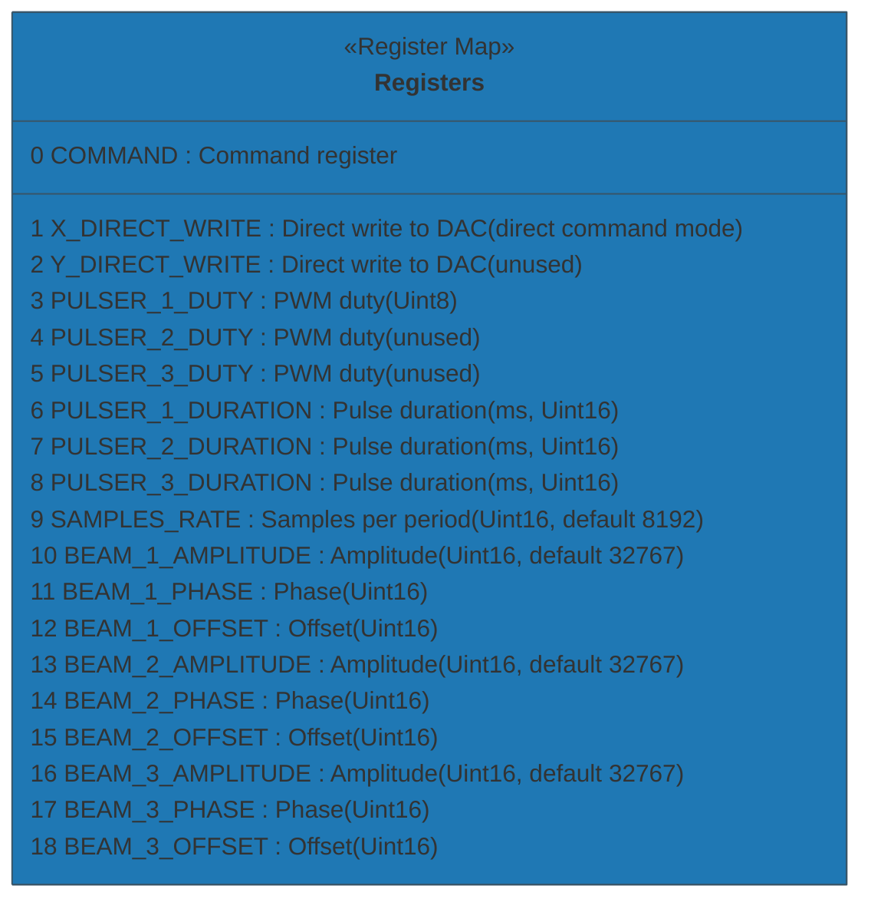

(The file `c:\Users\jnoro\research\EBEAM_dashboard\subsystem\beam_pulse\README.md` exists, but is empty)
# BeamPulseSubsystem (BCON) — Modbus driver

This directory contains the E5CN Modbus-compatible driver for the BeamPulseSubsystem (BCON).

Driver location: `subsystem/beam_pulse/beam_pulse.py`

Key assumptions and design notes:

- Registers are mapped as zero-based holding registers by address. If your hardware uses a different offset or page mapping, adjust the `REGISTER` map in `BeamPulseSubsystem`.
- Beam amplitude/phase/offset and sample rate values are treated as unsigned 16-bit (0..65535).
- Pulsers' duty values are described as Uint8 in hardware docs; this driver writes them into single 16-bit registers for simplicity. If the device expects multiple 8-bit fields packed into a single 16-bit register or uses signed values, update the driver accordingly.
- The driver uses the project's `E5CNModbus` wrapper found at `instrumentctl/E5CN_modbus/E5CN_modbus.py` for serial/Modbus I/O and reuses its `modbus_lock` for thread-safety.

Register map (mermaid table):



Interactive examples (Python REPL)

Below are quick interactive examples showing how to use the driver. These assume you have a serial device connected at `COM3` and the appropriate virtual environment activated.

1) Start a Python REPL with your project's virtual environment active, or use `python -c` for quick calls.

```powershell
# Activate your venv first (Windows PowerShell)
& .\venv\Scripts\Activate.ps1
python
```

2) In Python, create and use the `BeamPulseSubsystem`:

```python
from subsystem.beam_pulse.beam_pulse import BeamPulseSubsystem

# connect to COM port and unit id 1
b = BeamPulseSubsystem(port='COM3', unit=1, baudrate=115200, debug=True)
if not b.connect():
	raise SystemExit('Could not connect to BCON device')

# read a single register
samples = b.read_register('SAMPLES_RATE')
print('samples rate =', samples)

# set beam 1 amplitude
ok = b.set_beam_parameters(1, amplitude=32767)
print('set beam 1 amplitude:', ok)

# set pulser 1 duty (0..255)
ok = b.set_pulser_duty(1, 128)
print('set pulser 1 duty:', ok)

# read all registers
all_vals = b.read_all()
for k, v in all_vals.items():
	print(k, "=>", v)

# clean up
b.disconnect()
```

3) Quick one-liners (non-interactive) — useful for scripts:

```powershell
python -c "from subsystem.beam_pulse.beam_pulse import BeamPulseSubsystem; b=BeamPulseSubsystem(port='COM3'); b.connect(); print(b.read_register('SAMPLES_RATE')); b.disconnect()"
```

Troubleshooting
- If you see connection issues, confirm serial port permissions and that the device is using the same baudrate and parity settings as provided to `BeamPulseSubsystem`.
- If register reads return None or "ERROR", enable `debug=True` when creating the `BeamPulseSubsystem` to get more verbose logs from the underlying `E5CNModbus` wrapper.
- If you need different register addresses or packing, edit `REGISTER` in `subsystem/beam_pulse/beam_pulse.py`.

Security note
- This driver does not attempt authentication. Operate it only on trusted and isolated networks or serial connections. Avoid exposing serial-modbus-connected devices to public or untrusted networks.

-----
