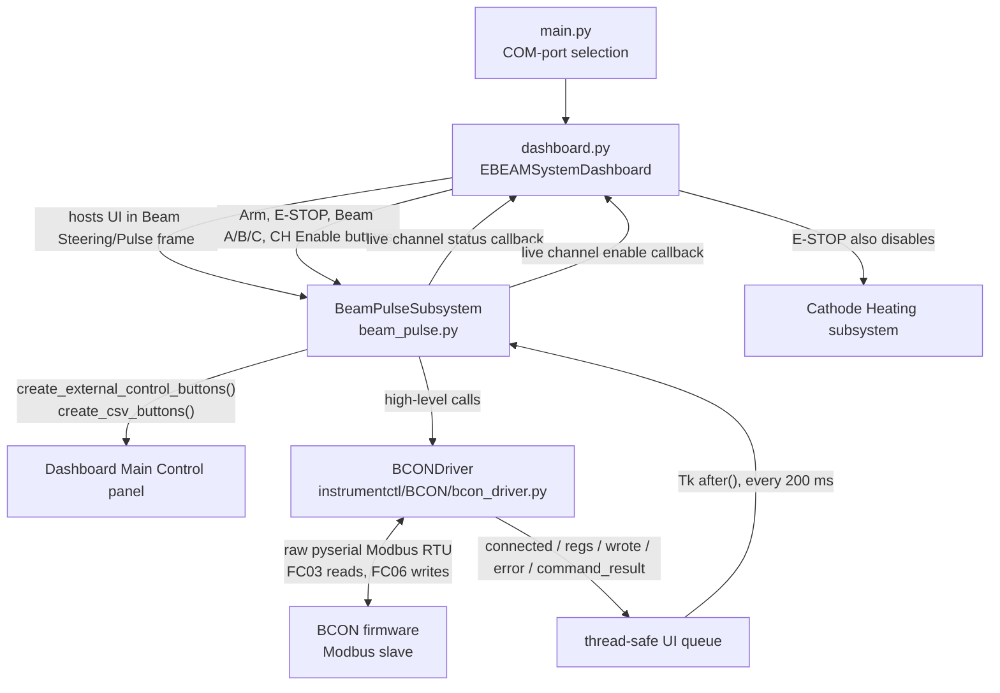

# Beam Pulse Subsystem

`BeamPulseSubsystem` is the Dashboard-facing control layer for the BCON beam
pulser. It provides a Tkinter UI for three pulser channels, A/B/C, and delegates
hardware communication to `instrumentctl.BCON.BCONDriver`.

The current implementation controls channel mode, pulse duration, pulse count,
hardware enable state, synchronized starts, all-channel stop, and CSV pulse
sequences.

## Top-Level Flow



## Active UI

The status bar shows:

- BCON connection indicator.
- Hardware interlock and watchdog state from BCON registers.
- Watchdog setting entry and `Set` button.
- A one-line event/status log.
- `Connect` / `Reconnect` / `Disconnect` button.

The notebook has two active tabs:

- `Manual Control`: one card per channel. Each card has mode, duration, count,
  live status, and remaining pulse count.
- `CSV Sequence`: loaded-file name, sequence progress, and a text preview of
  the parsed sequence.

## Hardware Interface

BCON communication is register-based Modbus RTU over a serial port.

`BeamPulseSubsystem` imports register constants and mode labels from
`instrumentctl.BCON` and creates a `BCONDriver` when a `port` is provided. The
driver owns the serial port, write queue, register cache, and background poll
thread.

Important register groups used by Beam Pulse:

| Registers | Purpose |
| --- | --- |
| `0` | Watchdog timeout in ms |
| `1` | Firmware telemetry interval in ms |
| `2` | Command register, including all-off and apply-staged-modes |
| `10/20/30 + offsets` | Channel A/B/C requested mode, pulse ms, count, enable set |
| `100+` | System state and diagnostics |
| `103` | Hardware interlock OK |
| `104` | Watchdog OK |
| `110/120/130 + offsets` | Channel A/B/C actual mode, pulse ms, count, remaining, enable, power, overcurrent, gated, output level |

The driver sends register snapshots to `BeamPulseSubsystem` through `_ui_queue`
as `("regs", regs)` messages. The subsystem consumes the queue on the Tk main
thread every 200 ms, updates widgets, and forwards live state to Dashboard
callbacks.

On connect, the subsystem applies its preferred defaults:

- Watchdog: `BCONDriver.DEFAULT_WATCHDOG_MS` currently 1500 ms.
- Telemetry: `BCONDriver.DEFAULT_TELEMETRY_MS` currently 500 ms.

## Channel Modes

The current mode set mirrors `BCONMode`:

| Mode | Meaning | Parameters |
| --- | --- | --- |
| `OFF` | Channel output off | Duration/count ignored |
| `DC` | Continuous output while active | Duration/count ignored |
| `PULSE` | Single pulse | Duration must be greater than 0 ms; count is forced to 1 |
| `PULSE_TRAIN` | Multiple pulses | Duration must be greater than 0 ms; count must be at least 2 |

The UI only allows whole-number text entry for duration/count and validates
again before sending commands. The driver also enforces firmware-facing limits
for pulse duration and count.

## Safety Model

There are two safety layers:

- Dashboard software arming: `arm_beams()` and `disarm_beams()` gate user actions
  in the GUI. Actions that start output call `_require_armed()`. Stop, off,
  disarm, and E-STOP paths remain available.
- BCON firmware safety: hardware interlock and watchdog state are enforced below
  the Dashboard and reported through registers.

Important behavior:

- `BEAMS ARMED` is a software gate, not a hardware arm command.
- `disarm_beams()` stops any CSV sequence, sends all channels off through
  `set_all_beams_status(False)`, calls `bcon_driver.stop_all()`, and disables
  armed-gated buttons.
- Dashboard `BEAMS E-STOP` calls `stop_all_channels()`, tells the Cathode
  Heating subsystem to turn off all beams, then disarms Beam Pulse.
- `Sync Stop`, channel OFF, disarm, disconnect, and safe shutdown do not require
  the armed state.

### Dashboard Arm Beams Button

The Dashboard `ARM BEAMS` / `BEAMS ARMED` control is the software
permission switch for Beam Pulse actions.Arming does
NOT start output, enable a channel, turn on cathode heating, or send a hardware
arm command to BCON. It only allows armed-gated Dashboard controls to be used.

When beams are armed, the operator can:

- Toggle BCON channel enable states with the `CH A/B/C` enable buttons.
- Turn individual Beam A/B/C outputs on from their Dashboard buttons, for
  channels that are currently hardware-enabled.
- Use `Sync Start` from the Manual Control configuration.
- Run a loaded CSV sequence, when BCON is connected.

Press the same button again while beams are armed to disarm Beam Pulse. Disarm
stops any running CSV sequence, commands all BCON beam channels off when a BCON
driver is available, disables armed-gated controls, and resets Dashboard beam
buttons to OFF. It does not turn off cathode heater power-supply outputs; use
`BEAMS E-STOP` when cathode heater outputs must also be shut off.

## Dashboard Interfaces

`dashboard.py` integrates Beam Pulse in `create_subsystems()`:

```python
beam_pulse_subsystem = BeamPulseSubsystem(
    parent_frame=parent,
    port=bp_port if bp_port else None,
    unit=1,
    baudrate=115200,
    logger=self.logger,
)
```

The COM-port key is normally `BeamPulse` from `main.py`; Dashboard also accepts
`Beam Pulse` as a fallback.

Dashboard-to-BeamPulse calls:

| Dashboard action | Beam Pulse API |
| --- | --- |
| Arm/disarm button | `arm_beams()`, `disarm_beams()`, `get_beams_armed_status()` |
| E-STOP | `stop_all_channels()`, `disarm_beams()` |
| Beam A/B/C ON | `send_channel_config(channel_index)` |
| Beam A/B/C OFF | `send_channel_off(channel_index)` |
| Channel enable toggle | `bcon_driver.set_channel_enable(channel, enabled)` and, when disabling, `send_channel_off(channel_index)` |
| Main-control sync row | `create_external_control_buttons(...)` |
| CSV buttons | `create_csv_buttons(parent_frame)` |

BeamPulse-to-Dashboard callbacks:

| Registration method | Callback shape | Purpose |
| --- | --- | --- |
| `set_dashboard_beam_callback(callback)` | `callback(beam_index, status)` | Immediate Dashboard button updates after subsystem commands |
| `set_channel_status_callback(callback)` | `callback(ch, mode_code, remaining)` | Live register-backed Beam A/B/C button state |
| `set_channel_enable_status_callback(callback)` | `callback(ch, enabled)` | Live register-backed channel enable state |
| `set_channel_enable_getter(getter)` | `getter() -> list[bool]` | Lets `Sync Start` skip channels that are not hardware-enabled |

Dashboard stores Beam Pulse in `self.subsystems["Beam Pulse"]`.

## Manual And Sync Operation

Manual Control stores one GUI configuration per channel in `channel_vars`.
`get_channel_config(ch)` returns that channel's selected mode, duration, and
count with safe defaults if widgets are unavailable.

`send_channel_config(ch)`:

1. Requires beams to be armed.
2. Validates mode-specific duration/count.
3. Calls `bcon_driver.set_channel_mode(ch + 1, mode, duration_ms, count)`.
4. Updates `beam_on_status[ch]`.
5. Notifies the Dashboard beam callback.

`send_channel_off(ch)` sends OFF immediately and does not require arming.

`Sync Start` reads all three Manual Control configurations, filters out
hardware-disabled channels using the registered enable getter, then calls
`bcon_driver.sync_start(configs)`. The driver stages pulse parameters and
requested modes, then commits them together with the firmware apply command.

`Sync Stop` calls `bcon_driver.stop_all()`.

## CSV Sequences

CSV controls are added to the Dashboard main control panel. The `CSV Sequence`
tab shows the loaded file, progress, and parsed preview.

Accepted columns:

```csv
step,ch,mode,duration_ms,count,dwell_ms
```

Rules:

- Blank lines and lines beginning with `#` are ignored.
- A header line starting with `step` is ignored.
- `step` is an integer. Rows with the same step number are launched together.
- `ch` is `1`, `2`, `3`, or `ALL`.
- `mode` is `OFF`, `DC`, `PULSE`, or `PULSE_TRAIN`.
- `duration_ms` defaults to `100` if omitted.
- `count` defaults to `1` if omitted.
- `dwell_ms` is the wait after the step before the next step. If multiple rows
  share a step, the last parsed row's dwell value is used for that step.
- `PULSE_TRAIN` requires `count >= 2`.

Example:

```csv
step,ch,mode,duration_ms,count,dwell_ms
1,1,PULSE,100,1,0
1,2,PULSE,200,1,500
2,ALL,OFF,,,250
3,3,PULSE_TRAIN,50,10,1000
```

Running a sequence requires:

- A loaded CSV file.
- Beams armed.
- Connected BCON driver.
- No currently running sequence worker.

The sequence runner uses a background thread. Each step calls
`bcon_driver.sync_start(configs)`, then sleeps for the step dwell while checking
the stop event. Stop, disarm, disconnect, and host shutdown all request the
worker to stop.

## Threading And Lifecycle

The subsystem keeps GUI work on the Tk main thread and hardware I/O off it:

- `BCONDriver` owns a background poll thread and serial lock.
- `BeamPulseSubsystem` consumes driver messages from `_ui_queue` with
  `parent_frame.after(200, ...)`.
- A CSV sequence uses one background worker thread.
- Auto-connect runs in a daemon thread when a port is supplied.
- The owning Tk toplevel is bound to `<Destroy>` so closing the Dashboard calls
  the same shutdown path as `close_com_ports()`.

Cleanup paths:

- `disconnect()` stops sequence playback, clears local armed/beam status, resets
  cached channel enable state, and disconnects the driver.
- `close_com_ports()` is the Dashboard cleanup hook.
- `cancel_updates()` cancels Beam Pulse `after()` callbacks.
- `safe_shutdown(reason)` disarms, turns all beams off, and logs the shutdown.

## Standalone Use

For a quick hardware/status check from the repository root:

```powershell
python -m subsystem.beam_pulse.beam_pulse --port COM3 --unit 1 --test-status
```

Headless use is also supported by constructing `BeamPulseSubsystem` with
`parent_frame=None`. In that mode no Tk widgets are created, but the connection,
status, and channel-control APIs are available when a `port` is supplied.

```python
from subsystem.beam_pulse.beam_pulse import BeamPulseSubsystem

bcon = BeamPulseSubsystem(parent_frame=None, port="COM3", unit=1, baudrate=115200)

if not bcon.connect():
    raise RuntimeError("Could not connect to BCON")

bcon.arm_beams()
bcon.set_channel_mode(0, "PULSE", duration_ms=100)
bcon.stop_all_channels()
bcon.disconnect()
```

## Dependencies

- Python standard library: `tkinter`, `threading`, `queue`, `time`, `pathlib`,
  `datetime`, `os`, `sys`.
- Project modules: `instrumentctl.BCON`, `utils.LogLevel`.
- Serial dependency: `pyserial`.
- Hardware: BCON firmware exposing the Modbus RTU register map expected by
  `instrumentctl/BCON/bcon_driver.py`.

## Implementation Notes

- Python API channel indexes are usually 0-based (`0`, `1`, `2` for A/B/C).
  `BCONDriver` channel numbers are 1-based (`1`, `2`, `3`).
- The subsystem creates `presets/` and `sequences/` in the current working
  directory. `sequences/` is used as the default file-dialog location.
- Live hardware mode is displayed in each channel status label but is not pushed
  back into the mode combobox. This preserves the user's intended next command.
- Manual controls are locked while a channel is running, based on live status
  registers. DC is treated as running even though remaining count is zero.
- Most command writes are queued through the driver poll thread. Channel enable
  writes use the driver's immediate register write path so the Dashboard button
  state can update promptly.
