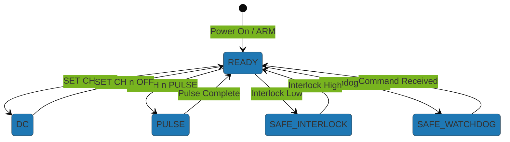

# BeamPulseSubsystem (BCON) - Pulser Control GUI

This directory contains the Beam Pulse control subsystem for the EBEAM Dashboard.

**Location:** `subsystem/beam_pulse/beam_pulse.py`

## Overview

`BeamPulseSubsystem` is a tkinter-based GUI control interface for the BCON beam pulse hardware. It provides high-level controls for configuring wave generation, pulsing behavior, and beam parameters across three independent beams (A, B, C).

**Key Features:**
- **GUI Interface:** Tabbed interface (Main and Config tabs) with real-time controls
- **Wave Generation:** Wave type selection, frequency control, and amplitude adjustment
- **Pulsing Control:** Configure pulsing behavior and individual beam durations
- **Hardware Communication:** Uses `BCONDriver` from `instrumentctl/BCON/` for RS-485 serial communication
- **Connection Monitoring:** Real-time BCON connection status indicator
- **Safety Features:** Beam arming/disarming with safe shutdown capabilities
- **Deflection Bounds:** Configurable amplitude and frequency limits in Config tab

## Architecture

The subsystem integrates with the dashboard through:
- **Hardware Layer:** `BCONDriver` handles low-level RS-485 serial communication with Arduino firmware
- **Control Layer:** `BeamPulseSubsystem` provides GUI controls and logic
- **Integration:** Dashboard callbacks for beam status synchronization

## Hardware Communication

The subsystem communicates with BCON hardware through RS-485 serial commands (not Modbus registers). The BCON Arduino firmware supports the following command interface:

### Command Structure

| Command | Example | Description |
|---------|---------|-------------|
| `PING` | `PING\n` | Check communication and refresh watchdog |
| `STATUS` | `STATUS\n` | Get full system and channel status |
| `STOP ALL` | `STOP ALL\n` | Force all channels to OFF mode |
| `SET WATCHDOG` | `SET WATCHDOG 1000\n` | Set watchdog timeout (50-60000 ms) |
| `SET TELEMETRY` | `SET TELEMETRY 500\n` | Set telemetry interval (0=disabled) |
| `SET CH OFF` | `SET CH 1 OFF\n` | Turn off channel 1 |
| `SET CH DC` | `SET CH 2 DC\n` | Set channel 2 to DC mode |
| `SET CH PULSE` | `SET CH 3 PULSE 250\n` | Pulse channel 3 for 250ms |

### System States

- **READY** - System ready for commands, outputs can be enabled
- **SAFE_INTERLOCK** - Interlock signal low, all outputs forced OFF
- **SAFE_WATCHDOG** - Communication watchdog expired, all outputs forced OFF

### Channel Modes

- **OFF** - Channel output is LOW (no beam formation)
- **DC** - Channel output is HIGH (continuous beam)
- **PULSE** - Channel pulses HIGH for configured duration then returns to OFF

### Telemetry

BCON periodically transmits telemetry:

```
SYS state=READY reason=READY fault_latched=0 telemetry_ms=500
CH1 mode=DC pulse_ms=0 en_st=1 pwr_st=1 oc_st=0 gated_st=0
CH2 mode=OFF pulse_ms=0 en_st=0 pwr_st=1 oc_st=0 gated_st=0
CH3 mode=PULSE pulse_ms=250 en_st=1 pwr_st=1 oc_st=0 gated_st=0
```



## GUI Controls

### Main Tab

**Wave Generation:**
- **Wave Type:** Dropdown selection (Sine, Triangle, Sawtooth, Square, DC)
- **Frequency:** Spinbox control with bounds (Hz)
- **Wave Amplitude:** Spinbox control with bounds (Amperes)
- **Connection Status:** Real-time BCON connection indicator

**Pulsing Behavior:**
- Dropdown selection for pulse control mode
- Individual beam duration controls for Beams A, B, C (milliseconds)

### Config Tab

**Deflection Amplitude Bounds:**
- Lower and upper bounds for deflection amplitude (Amperes)
- Applied limits constrain wave amplitude spinbox range

**Deflection Frequency Bounds:**
- Lower and upper bounds for deflection frequency (Hz)
- Applied limits constrain frequency spinbox range

## Usage Examples

### 1. Integrating with Dashboard (Typical Usage)

The subsystem is typically used as part of the main dashboard:

```python
import tkinter as tk
from subsystem.beam_pulse.beam_pulse import BeamPulseSubsystem

# Create main window
root = tk.Tk()
root.title("Beam Pulse Control")

# Create BeamPulseSubsystem with GUI and hardware connection
beam_pulse = BeamPulseSubsystem(
    parent_frame=root,
    port='COM3',
    baudrate=115200,
    debug=True
)

# Connect to hardware
if beam_pulse.connect():
    print("Connected to BCON hardware")
else:
    print("Failed to connect to BCON")

# Setup GUI
beam_pulse.setup_ui()

# Run GUI
root.mainloop()

# Clean up on exit
beam_pulse.disconnect()
```

### 2. Headless Mode (Hardware Control Only)

For automated control without GUI:

```python
from subsystem.beam_pulse.beam_pulse import BeamPulseSubsystem

# Create subsystem without GUI (parent_frame=None)
beam_pulse = BeamPulseSubsystem(
    parent_frame=None,  # No GUI
    port='COM3',
    baudrate=115200,
    debug=True
)

# Connect to hardware
if not beam_pulse.connect():
    raise SystemExit('Could not connect to BCON device')

# Ping device
if beam_pulse.ping():
    print("Device responding")

# Get system status
status = beam_pulse.get_system_status()
print(f"System state: {status['system']['state']}")

# Set channel 1 to DC mode
if beam_pulse.set_channel_mode(0, 'DC'):
    print("Channel 1 in DC mode")

# Pulse channel 2 for 250ms
if beam_pulse.set_channel_mode(1, 'PULSE', 250):
    print("Channel 2 pulsing")

# Stop all channels
beam_pulse.stop_all_channels()

# Safe shutdown
beam_pulse.safe_shutdown("Test complete")
beam_pulse.disconnect()
```

### 3. Dashboard Integration

Setting up dashboard callback for beam status synchronization:

```python
def beam_status_callback(beam_index, enabled):
    """Handle beam status changes from dashboard."""
    print(f"Beam {beam_index} {'enabled' if enabled else 'disabled'}")

# Set dashboard callback
beam_pulse.set_dashboard_beam_callback(beam_status_callback)

# Get integration status
status = beam_pulse.get_integration_status()
print(f"Dashboard integration: {status}")
```

## API Reference

### Connection Management

- `connect() -> bool` - Connect to BCON hardware
- `disconnect() -> None` - Disconnect from hardware
- `is_connected() -> bool` - Check connection status
- `ping() -> bool` - Ping device to verify communication

### System Status

- `get_system_status() -> Dict` - Get full system and channel status
- `get_beams_armed_status() -> bool` - Check if beams are armed

### Channel Control

- `set_channel_mode(channel_index: int, mode: str, duration_ms: int = 0) -> bool` - Set channel mode (OFF, DC, PULSE)
- `stop_all_channels() -> bool` - Stop all channels immediately
- `set_beam_status(beam_index: int, status: bool)` - Set individual beam on/off
- `get_beam_status(beam_index: int) -> bool` - Get beam status
- `set_all_beams_status(status: bool)` - Set all beams to same status

### Configuration

- `get_pulsing_behavior() -> str` - Get current pulsing mode (DC or Pulsed)
- `get_beam_duration(beam_index: int) -> float` - Get beam pulse duration
- `get_deflection_bounds() -> tuple` - Get (lower, upper) amplitude bounds
- `is_deflection_within_bounds(value: float) -> bool` - Validate amplitude value

### Safety Features

- `arm_beams() -> bool` - Enable beam operations through the dashboard's software interlock
- `disarm_beams() -> bool` - Disable beam operations (stops all channels)
- `safe_shutdown(reason: Optional[str] = None) -> bool` - Safe shutdown of all beams
- `get_beams_armed_status() -> bool` - Check if beams are armed

### Status Monitoring

- `get_pulser_overcurrent_status(pulser_index: int) -> bool` - Check channel overcurrent status
- `set_bcon_connection_status(status: bool)` - Update BCON connection status indicator

## Hardware Register Details

**Note:** BCON firmware uses RS-485 serial commands, not Modbus registers. See the **Hardware Communication** section above for command details.

**Communication Details:**
- **Protocol:** RS-485 serial (ASCII commands, newline terminated)
- **Baud Rate:** 115200 (configurable)
- **Parity:** None
- **Stop Bits:** 1
- **Data Bits:** 8
- **Flow Control:** None

**Channel Numbers:**
- Python API uses 0-based indexing (0, 1, 2 for channels A, B, C)
- Arduino firmware uses 1-based channel numbers (1, 2, 3)
- Driver automatically converts between the two

**Pulse Duration Range:** 1-60000 milliseconds
**Watchdog Range:** 50-60000 milliseconds

## Troubleshooting

### Connection Issues
- Verify serial port permissions and COM port name (e.g., 'COM3' on Windows)
- Confirm device baudrate matches (default: 115200)
- Check RS-485 transceiver connections and termination resistors
- Enable `debug=True` for verbose communication logs

### Command Failures
- If commands return `False`, check system state with `get_system_status()`
- System must be in **READY** state to accept channel control commands
- If in SAFE_INTERLOCK, check hardware interlock signal
- If commands are blocked, check the external interlock input and watchdog health

### GUI Issues
- If GUI doesn't appear, verify `parent_frame` is a valid tkinter widget
- If controls are disabled, check BCON connection status indicator
- Connection monitoring runs every 2 seconds - allow time for status updates

### Hardware Issues
- Check Arduino power and RS-485 transceiver power
- Verify interlock signal is HIGH (5V) when operation is expected
- Monitor telemetry for overcurrent conditions (`oc_st`)
- Use device `PING` command to verify basic communication

## Dependencies

- **Python Standard Library:** tkinter, ttk, threading
- **Third-Party:** pyserial (for RS-485 serial communication)
- **Project Modules:**
  - `instrumentctl.BCON.bcon_driver` - BCON RS-485 driver
  - `utils` - Logging utilities (LogLevel)
- **Hardware:** Arduino Mega running BCON firmware with RS-485 interface

## Security Notes

- This subsystem does not implement authentication
- Operate only on trusted, isolated serial connections
- Do not expose RS-485 serial devices to untrusted networks
- Use proper physical access controls for hardware
- Interlock signal provides hardware-level safety override

## Development

To run the subsystem standalone for testing:

```powershell
# From project root
python -m subsystem.beam_pulse.beam_pulse --port COM3 --test-status
```

Command-line arguments:
- `--port`: Serial port name (default: COM1)
- `--test-status`: Read system status on connection

---

For integration examples, see the main dashboard implementation in [dashboard.py](../../dashboard.py).
