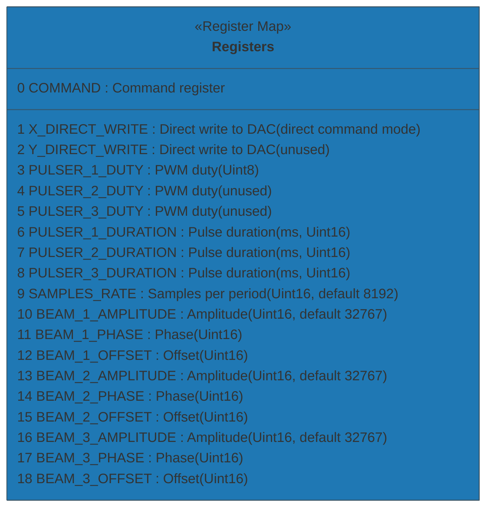

# BeamPulseSubsystem (BCON) - Pulser Control GUI

This directory contains the Beam Pulse control subsystem for the EBEAM Dashboard.

**Location:** `subsystem/beam_pulse/beam_pulse.py`

## Overview

`BeamPulseSubsystem` is a tkinter-based GUI control interface for the BCON beam pulse hardware. It provides high-level controls for configuring wave generation, pulsing behavior, and beam parameters across three independent beams (A, B, C).

**Key Features:**
- **GUI Interface:** Tabbed interface (Main and Config tabs) with real-time controls
- **Wave Generation:** Wave type selection, frequency control, and amplitude adjustment
- **Pulsing Control:** Configure pulsing behavior and individual beam durations
- **Hardware Communication:** Uses `E5CNModbus` driver from `instrumentctl/E5CN_modbus/` for Modbus RTU serial communication
- **Connection Monitoring:** Real-time BCON connection status indicator
- **Safety Features:** Beam arming/disarming with safe shutdown capabilities
- **Deflection Bounds:** Configurable amplitude and frequency limits in Config tab

## Architecture

The subsystem integrates with the dashboard through:
- **Hardware Layer:** `E5CNModbus` wrapper handles low-level Modbus RTU communication
- **Control Layer:** `BeamPulseSubsystem` provides GUI controls and logic
- **Integration:** Dashboard callbacks for beam status synchronization

## Hardware Register Map

The subsystem communicates with BCON hardware through these Modbus holding registers (zero-based addressing):



## GUI Controls

### Main Tab

**Wave Generation:**
- **Wave Type:** Dropdown selection (Sine, Triangle, Sawtooth, Square, DC)
- **Frequency:** Spinbox control with bounds (Hz)
- **Wave Amplitude:** Spinbox control with bounds (Amperes)
- **Connection Status:** Real-time BCON connection indicator

**Pulsing Behavior:**
- Dropdown selection for pulse control mode
- Individual beam duration controls for Beams A, B, C (milliseconds)

### Config Tab

**Deflection Amplitude Bounds:**
- Lower and upper bounds for deflection amplitude (Amperes)
- Applied limits constrain wave amplitude spinbox range

**Deflection Frequency Bounds:**
- Lower and upper bounds for deflection frequency (Hz)
- Applied limits constrain frequency spinbox range

## Usage Examples

### 1. Integrating with Dashboard (Typical Usage)

The subsystem is typically used as part of the main dashboard:

```python
import tkinter as tk
from subsystem.beam_pulse.beam_pulse import BeamPulseSubsystem

# Create main window
root = tk.Tk()
root.title("Beam Pulse Control")

# Create BeamPulseSubsystem with GUI and hardware connection
beam_pulse = BeamPulseSubsystem(
    parent_frame=root,
    port='COM3',
    unit=1,
    baudrate=115200,
    debug=True
)

# Connect to hardware
if beam_pulse.connect():
    print("Connected to BCON hardware")
else:
    print("Failed to connect to BCON")

# Setup GUI
beam_pulse.setup_ui()

# Run GUI
root.mainloop()

# Clean up on exit
beam_pulse.disconnect()
```

### 2. Headless Mode (Hardware Control Only)

For automated control without GUI:

```python
from subsystem.beam_pulse.beam_pulse import BeamPulseSubsystem

# Create subsystem without GUI (parent_frame=None)
beam_pulse = BeamPulseSubsystem(
    parent_frame=None,  # No GUI
    port='COM3',
    unit=1,
    baudrate=115200,
    debug=True
)

# Connect to hardware
if not beam_pulse.connect():
    raise SystemExit('Could not connect to BCON device')

# Read register
samples = beam_pulse.read_register('SAMPLES_RATE')
print(f'Samples rate: {samples}')

# Set beam parameters
ok = beam_pulse.set_beam_parameters(1, amplitude=32767)
print(f'Set beam 1 amplitude: {ok}')

# Set pulser duty (0..255)
ok = beam_pulse.set_pulser_duty(1, 128)
print(f'Set pulser 1 duty: {ok}')

# Arm beams (safety feature)
if beam_pulse.arm_beams():
    print("Beams armed successfully")

# Read all registers
all_vals = beam_pulse.read_all()
for k, v in all_vals.items():
    print(f"{k} => {v}")

# Safe shutdown
beam_pulse.safe_shutdown("Test complete")
beam_pulse.disconnect()
```

### 3. Dashboard Integration

Setting up dashboard callback for beam status synchronization:

```python
def beam_status_callback(beam_index, enabled):
    """Handle beam status changes from dashboard."""
    print(f"Beam {beam_index} {'enabled' if enabled else 'disabled'}")

# Set dashboard callback
beam_pulse.set_dashboard_beam_callback(beam_status_callback)

# Get integration status
status = beam_pulse.get_integration_status()
print(f"Dashboard integration: {status}")
```

## API Reference

### Connection Management

- `connect() -> bool` - Connect to BCON hardware
- `disconnect() -> None` - Disconnect from hardware
- `is_connected() -> bool` - Check connection status

### Register Operations

- `read_register(name: str) -> Optional[int]` - Read single register
- `write_register(name: str, value: int) -> bool` - Write single register
- `read_all() -> Dict[str, Optional[int]]` - Read all registers

### Beam Control

- `arm_beams() -> bool` - Enable beam operations (safety)
- `disarm_beams() -> bool` - Disable beam operations
- `set_beam_parameters(beam_index: int, amplitude=None, phase=None, offset=None) -> Dict[str, bool]`
- `set_beam_status(beam_index: int, status: bool)` - Set individual beam on/off
- `get_beam_status(beam_index: int) -> bool` - Get beam status

### Pulser Control

- `set_pulser_duty(pulser_index: int, duty: int) -> bool` - Set duty cycle (0-255)
- `set_pulser_duration(pulser_index: int, duration_ms: int) -> bool` - Set pulse duration
- `get_pulsing_behavior() -> str` - Get current pulsing mode
- `get_beam_duration(beam_index: int) -> float` - Get beam pulse duration

### Configuration

- `get_deflection_bounds() -> tuple` - Get (lower, upper) amplitude bounds
- `is_deflection_within_bounds(value: float) -> bool` - Validate amplitude value

### Safety Features

- `safe_shutdown(reason: Optional[str] = None) -> bool` - Safe shutdown of all beams
- `get_beams_armed_status() -> bool` - Check if beams are armed

## Hardware Register Details

**Data Types:**
- Beam amplitude/phase/offset: Unsigned 16-bit (0..65535)
- Sample rate: Unsigned 16-bit (default: 8192)
- Pulser duty: Uint8 (0..255), written as 16-bit register
- Pulser duration: Uint16 (milliseconds)

**Register Access:**
- All registers are Modbus holding registers (function code 3 for read, 6/16 for write)
- Zero-based addressing (register 0 = COMMAND)
- Thread-safe access through `E5CNModbus` wrapper's modbus_lock

## Troubleshooting

### Connection Issues
- Verify serial port permissions and COM port name (e.g., 'COM3' on Windows)
- Confirm device baudrate matches (default: 115200)
- Check parity settings match between software and hardware
- Enable `debug=True` for verbose Modbus communication logs

### Register Read/Write Failures
- Returns `None` or `False` indicate communication errors
- Check physical connections and cable integrity
- Verify Modbus unit/slave address is correct (default: 1)
- Review debug logs from underlying `E5CNModbus` wrapper

### GUI Issues
- If GUI doesn't appear, verify `parent_frame` is a valid tkinter widget
- If controls are disabled, check BCON connection status indicator
- Connection monitoring runs every 2 seconds - allow time for status updates

### Hardware Configuration
- If register addresses differ from expected, modify the register map in [beam_pulse.py](beam_pulse.py)
- For custom register packing (e.g., dual 8-bit values in 16-bit register), update read/write methods

## Dependencies

- **Python Standard Library:** tkinter, ttk, threading
- **Project Modules:**
  - `instrumentctl.E5CN_modbus.E5CN_modbus` - Modbus RTU driver
  - `utils` - Logging utilities (LogLevel)
- **Hardware:** BCON device with Modbus RTU serial interface

## Security Notes

- This subsystem does not implement authentication
- Operate only on trusted, isolated serial connections
- Do not expose Modbus serial devices to untrusted networks
- Use proper physical access controls for hardware

## Development

To run the subsystem standalone for testing:

```powershell
# From project root
python -m subsystem.beam_pulse.beam_pulse --port COM3 --unit 1 --read-all
```

Command-line arguments:
- `--port`: Serial port name (default: COM1)
- `--unit`: Modbus unit/slave ID (default: 1)
- `--read-all`: Read all registers on connection

---

For integration examples, see the main dashboard implementation in [dashboard.py](../../dashboard.py).
