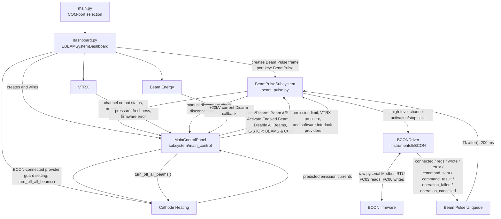

# Beam Pulse Subsystem

`BeamPulseSubsystem` is the dashboard-facing control layer for the BCON beam
pulser. It owns the Beam Pulse subpanel UI, BCON driver connection, channel
configuration validation, CSV sequence playback, Main Control software-interlock
filtering for bulk activation, and the software checks that run before
output-producing BCON commands.

Main Control is the operator control surface for most beam actions. Beam Pulse
keeps the hardware-facing state and reports live status back to Main Control.

## Top-Level Flow


```mermaid
flowchart TD
    Main["main.py<br/>COM-port selection"] --> Dashboard["dashboard.py<br/>EBEAMSystemDashboard"]

    Dashboard -->|"creates Beam Pulse frame<br/>port key: BeamPulse"| BeamPulse["BeamPulseSubsystem<br/>beam_pulse.py"]
    Dashboard -->|"creates and wires"| MainControl["MainControlPanel<br/>subsystem/main_control"]
    Dashboard --> BeamEnergy["Beam Energy"]
    Dashboard --> Cathode["Cathode Heating"]
    Dashboard --> VTRX["VTRX"]

    MainControl -->|"Arm/Disarm, Beam A/B/C,<br/>Activate Enabled Beams / Disable All Beams,<br/>E-STOP: BEAMS & CCS"| BeamPulse
    BeamPulse -->|"channel output status,<br/>armed state, action feedback"| MainControl
    MainControl -->|"emission-limit, VTRX-pressure,<br/>and software-interlock providers"| BeamPulse
    Cathode -->|"predicted emission currents"| MainControl
    VTRX -->|"pressure, freshness, firmware error"| MainControl
    BeamPulse -->|"manual disconnect check,<br/>disconnect notification"| MainControl
    MainControl -->|"BCON-connected provider,<br/>guard setting, turn_off_all_beams()"| Cathode

    BeamEnergy -->|"+20kV current Disarm callback"| MainControl
    MainControl -->|"turn_off_all_beams()"| Cathode

    BeamPulse -->|"high-level channel activation/stop calls"| Driver["BCONDriver<br/>instrumentctl/BCON"]
    Driver <-->|"raw pyserial Modbus RTU<br/>FC03 reads, FC06 writes"| Firmware["BCON firmware"]
    Driver -->|"connected / regs / wrote / error /<br/>command_sent / command_result /<br/>operation_failed / operation_cancelled"| Queue["Beam Pulse UI queue"]
    Queue -->|"Tk after(), 200 ms"| BeamPulse
```

## UI Structure

Beam Pulse itself has a compact status bar and two tabs.

- Status bar: BCON connection indicator, hardware interlock/watchdog text,
  watchdog setting entry, event log line, and Connect/Reconnect/Disconnect.
- `Manual Control`: one card per channel A/B/C with mode, pulse duration,
  pulse count, live status, and remaining pulse count.
- `CSV Sequence`: loaded file name, progress, Load CSV, Save Template, Run,
  Stop, and a preview of parsed steps.

Main Control is a separate subpanel, but it is the normal place operators start
beam actions. It hosts the BEAMS ARMED toggle, `E-STOP: BEAMS & CCS`, Beam A/B/C ON/OFF buttons,
dashboard-only Beam A/B/C software interlocks, Activate Enabled Beams / Disable
All Beams, and the four-line beam status/action display. The Beam Pulse Manual
cards provide `Toggle PVX A Enable`, `Toggle PVX B Enable`, and
`Toggle PVX C Enable` buttons for the hardware one-shot commands.

## Code Structure

- `subsystem/beam_pulse/beam_pulse.py`: Tk UI, BCON lifecycle, channel config
  validation, arming state, emission-limit checks, CSV parsing/playback, and
  callback registration for Main Control.
- `instrumentctl/BCON/bcon_driver.py`: register-level Modbus RTU driver. It owns
  the serial port, write queue, register cache, background poll thread, staged
  channel mode writes, command writes, and firmware status reads.
- `subsystem/main_control/main_control.py`: calls Beam Pulse APIs for operator
  actions and receives Beam Pulse callbacks for live status/action displays.

## BCON Interface

BCON communication is register-based Modbus RTU over serial. Beam Pulse creates
a `BCONDriver` when a port is configured; otherwise the subpanel can still be
constructed but cannot connect or send commands.

| Registers | Purpose |
| --- | --- |
| `0` | Watchdog timeout in ms |
| `1` | Firmware telemetry interval in ms |
| `2` | Command register, including all-off and apply-staged-modes |
| `10/20/30 + offsets` | Channel A/B/C requested mode, pulse ms, count, and PVX enable-toggle command (`+3`) |
| `100+` | System state and diagnostics |
| `103` | Hardware interlock OK |
| `104` | Watchdog OK |
| `110/120/130 + offsets` | Channel A/B/C actual mode, pulse ms, count, remaining, enable-toggle busy (`+4`), power, overcurrent, gated, output level |

The driver sends register snapshots to `BeamPulseSubsystem` through `_ui_queue`
as `("regs", regs, generation, completed_at)` messages. The subsystem consumes
the queue on the Tk main thread every 200 ms, updates widgets, and forwards live
state to Main Control callbacks.

### Operation-token bridge

Main Control creates one opaque token such as `bcon-7` for each coordinated
dashboard action. Beam Pulse does not allocate or parse the token. It passes
the same `operation_token` through its action API into the BCON driver:

| Beam Pulse API | Driver API |
| --- | --- |
| `send_channel_config()` | `set_channel_mode()` |
| `send_channel_off()` | `set_channel_off()` |
| `activate_enabled_beams()` | `sync_start()` |
| `disable_all_beams()` | `stop_all()` |
| `stop_all_channels()` | `stop_all()` |
| `disarm_beams()` | `stop_all()` |

The driver posts tokenized queue messages. Beam Pulse translates them for the
Main Control action-feedback callback without treating them as live output
state:

| Driver queue message | Beam Pulse callback event | Token field |
| --- | --- | --- |
| `command_sent` | `operation_sent` | `token` |
| `command_result` | `operation_result` | `operation_token` |
| `operation_failed` | `operation_failed` | `token` |
| `operation_cancelled` | `operation_cancelled` | `token` |

`command_sent` also carries the monotonic `sent_at` time. A complete `regs`
message carries a poll `generation` and `completed_at`, but intentionally has no
operation token. Beam Pulse first updates all live channel UI/callback state
from that snapshot, then emits `operation_poll`. Main Control may use that poll
to finish only its currently pending operation, and only when `completed_at` is
later than `sent_at` and the expected channel state is present. Late command
events with an older token are ignored.

This separates three different facts:

1. A request was written to the terminal BCON command register.
2. Firmware diagnostics reported the command `EXECUTED` or `REJECTED`.
3. A later complete poll showed the resulting hardware state.

Main Control uses all three phases for coordinated beam actions and deferred
software-state changes. CSV sequence steps and PVX enable-toggle requests use
the un-tokenized path. Direct untokenized Beam Pulse mode actions can use the
legacy firmware-ack context queue for operator logging.

The driver-side queue metadata (`batch`, `stage`, `terminal`, and write epoch),
failure recovery, and exact event payloads are documented in
`instrumentctl/BCON/README.md`.

Driver warning/error logs are also routed through the same UI queue, so BCON
worker-thread diagnostics are displayed through the dashboard logging path
instead of being printed directly from the worker.

On connect, the subsystem applies its preferred defaults:

- Watchdog: `BCONDriver.DEFAULT_WATCHDOG_MS` currently 1500 ms.
- Telemetry: `BCONDriver.DEFAULT_TELEMETRY_MS` currently 500 ms.

The driver uses a short serial read timeout and disconnects itself after a
bounded number of consecutive polling failures. When that happens, Beam Pulse
clears its local armed/output state, updates its UI, and emits
the registered disconnect callback.

## Channel Modes

The current mode set mirrors `BCONMode`:

| Mode | Meaning | Parameters |
| --- | --- | --- |
| `OFF` | Channel output off | Duration/count ignored |
| `DC` | Continuous output while active | Duration/count ignored |
| `PULSE` | Single pulse | Duration must be 1-60000 ms; count is forced to 1 |
| `PULSE_TRAIN` | Multiple pulses | Duration must be 1-60000 ms; count must be 2-10000 |

The UI only allows whole-number text entry for duration/count and validates
again before sending commands. The driver also enforces firmware-facing limits
for pulse duration and count.

## Safety And Guard Rails

There are four layers of safety/status behavior to keep distinct:

- Beam Pulse software arming: `arm_beams()` allows output-producing actions;
  `disarm_beams()` stops CSV playback and commands confirmed BCON all-off. The
  Main Control path passes `defer_ui=True`, so `complete_disarm()` clears the
  armed/local output state only after the eligible post-command poll. A direct
  untokenized call without `defer_ui` commits that state after command
  confirmation.
- BCON firmware safety: hardware interlock and watchdog state remain enforced by
  BCON firmware and are reported through registers.
- Emission-current limit: when enabled, Beam Pulse blocks non-OFF Beam ON,
  Activate Enabled Beams, and CSV step commands when any projected cathode
  prediction is unknown/invalid, or when the projected emission
  current is at or above the Main Control limit. When disabled, Beam Pulse skips
  both prediction validation and the threshold comparison.
- BCON/CCS disconnect guard: Beam Pulse reports BCON disconnects to Main Control. Main Control then
  decides whether Cathode Heating should disable or block CCS output.

### Main Control Arm Beams Button

The Main Control `ARM BEAMS` / `BEAMS ARMED` control is the software
permission switch for Beam Pulse actions. Arming does NOT start output, enable
a channel, turn on cathode heating, or send a hardware arm command to BCON. It
only allows armed-gated Dashboard controls to be used.

When BCON is connected and beams are armed, the operator can:

- Enable a dashboard software interlock for a Beam A/B/C output button.
- Turn an individually software-enabled Beam A/B/C output on from its Dashboard
  button.
- Use `Activate Enabled Beams`, which filters by Main Control's dashboard
  software-interlock provider.
- Run a loaded CSV sequence, when BCON is connected.

Press the same button again while beams are armed to disarm Beam Pulse. A
successful Main Control disarm stops any running CSV sequence, confirms BCON
all-off, then disables armed-gated controls and resets Dashboard beam buttons
after the eligible full poll. If the driver is unavailable or all-off is not
confirmed, the disarm fails and the armed state is not committed. Disarm does
not turn off cathode heater power-supply outputs; use `E-STOP: BEAMS & CCS`
when cathode heater outputs must also be shut off.

### BCON Disconnect Integration

Beam Pulse exposes two disconnect-related hooks for Main Control:

- A manual-disconnect callback, called before an operator-requested BCON
  disconnect proceeds.
- A disconnect callback, called after Beam Pulse observes that BCON is no longer
  connected.

This keeps the BCON hardware lifecycle inside Beam Pulse while leaving the
cross-subsystem safety decision in Main Control. In the current dashboard
wiring, Main Control uses those hooks to warn the operator before a manual BCON
disconnect would shut down active CCS outputs, and to call Cathode Heating's
`turn_off_all_beams()` path when BCON is lost unexpectedly and the guard is
enabled.

## Main Control API

Main Control calls these Beam Pulse methods:

| Main Control action | Beam Pulse API |
| --- | --- |
| Arm/disarm | `arm_beams()`, `disarm_beams()`, `get_beams_armed_status()` |
| E-STOP: BEAMS & CCS | `stop_all_channels()`, then `disarm_beams()` |
| Beam A/B/C ON | `send_channel_config(channel_index)` |
| Beam A/B/C OFF | `send_channel_off(channel_index)` |
| Activate Enabled Beams / Disable All Beams | `activate_enabled_beams()`, `disable_all_beams()` |

The Beam Pulse Manual tab invokes `request_pvx_enable_toggle(channel_index)`
directly from the matching `Toggle PVX <channel> Enable` button.

Main Control registers these callbacks/providers on Beam Pulse:

| Registration method | Callback shape | Purpose |
| --- | --- | --- |
| `set_channel_status_callback(callback)` | `callback(ch, mode_code, remaining, config)` | live Beam A/B/C output display |
| `set_activation_interlock_provider(provider)` | `provider() -> iterable[bool]` | Main Control's dashboard-only A/B/C interlocks used by `activate_enabled_beams()` |
| `set_armed_status_callback(callback)` | `callback(armed)` | mirror software armed state |
| `set_action_feedback_callback(callback)` | `callback(event_type, payload_or_message, outcome, configs)` | action line, operation events, and firmware acknowledgement display; tokenized events use a dictionary payload |
| `set_emission_limit_providers(limit, currents)` | callables | emission-limit guard data; `currents()` returns A/B/C values as non-negative finite mA floats or `None` for unknown |
| `set_vtrx_pressure_guard_providers(enabled, pressure, limit, fresh)` | callables | VTRX high-pressure/freshness guard data |
| `set_manual_disconnect_callback(callback)` | `callback() -> bool` | ask Main Control whether a user-requested BCON disconnect may continue |
| `set_disconnect_callback(callback)` | `callback()` | notify Main Control after BCON disconnects |

## Manual And Enabled-Beam Operation

`get_channel_config(ch)` reads the next intended Manual Control config for one
channel. Live BCON status is shown in the status text labels in the channel cards.
When register status shows a channel running, Beam Pulse locks that channel's
mode/duration/count controls until the channel is no longer running. DC mode is
treated as running even though it has no remaining pulse countdown.

`send_channel_config(ch)`:

1. Requires beams to be armed and BCON to be connected.
2. Validates mode, duration, and count.
3. Runs the VTRX pressure and emission-current checks for non-OFF output.
4. Calls `bcon_driver.set_channel_mode(ch + 1, mode, duration_ms, count)`.
5. Queues the BCON staging writes and terminal command. It does not update local
   output state; complete BCON register polling remains the hardware truth.

For a short pulse, firmware can report that the command executed while the first
post-ack poll already shows the output OFF because the pulse completed. The
command acknowledgement therefore confirms execution, not that the output is
still high when the poll is rendered.

`send_channel_off(ch)` sends OFF command to BCON and does not require arming.

`Activate Enabled Beams` reads all three Manual Control configurations, filters out
channels whose Main Control dashboard software interlock is disabled, blocks
non-OFF output when VTRX pressure is stale, unavailable, or above Main Control's
pressure limit, or projected emission current is unavailable/invalid or at or
above the configured limit, then calls
`bcon_driver.sync_start(configs)`. The driver stages pulse parameters and
requested modes, then commits them together with the firmware apply command.
The interlock provider is fail-closed: an absent or false entry for a channel
means that channel is skipped rather than started.

`Toggle PVX <channel> Enable` writes `1` once to the per-channel command register:
R13 for Beam A, R23 for Beam B, or R33 for Beam C. The firmware self-clears the
register, treats `0` as a no-op, and produces one 100 ms PVX pulse when it
accepts the request. R114/R124/R134 report whether the corresponding pulse is
currently busy. The dashboard rate-limits each channel's requests to one write
per 150 ms; firmware remains authoritative for rejecting a conflicting request
and may record `LAST_ERROR=11`.

`disable_all_beams()` calls confirmed `bcon_driver.stop_all()`. Main Control
passes `defer_ui=True` for safety actions, so local output state remains
poll-derived until the post-ack full poll. The driver invalidates pre-existing
queued writes during this all-off path, so a Beam ON/apply write that was queued
or already dequeued before the stop request cannot run after the confirmed
`ALL_OFF`.

## CSV Sequences

CSV controls are hosted inside the Beam Pulse `CSV Sequence` tab above the
loaded-step preview. The tab shows the loaded file, progress, and parsed preview.

Accepted columns:

```csv
step,ch,mode,duration_ms,count,dwell_ms
```

Rules:

- Blank lines and lines beginning with `#` are ignored.
- A header line starting with `step` is ignored.
- Rows with the same `step` value are launched together.
- `ch` is `1`, `2`, `3`, or `ALL`.
- `mode` is `OFF`, `DC`, `PULSE`, or `PULSE_TRAIN`.
- Empty `duration_ms` defaults to `100`; empty `count` defaults to `1`.
- `dwell_ms` is the wait after the step before the next step. When multiple
  rows share a step, the last parsed dwell value for that step is used.
- `PULSE_TRAIN` requires `count >= 2`.

Example:

```csv
step,ch,mode,duration_ms,count,dwell_ms
1,1,PULSE,100,1,0
1,2,PULSE,200,1,500
2,ALL,OFF,,,250
3,3,PULSE_TRAIN,50,10,1000
```

Running a sequence requires:

- A loaded CSV file.
- Beams armed.
- Connected BCON driver.
- No currently running sequence worker.

The sequence runner uses a background thread. Each step calls
the shared VTRX-pressure and emission-current checks before
`bcon_driver.sync_start(configs)`,
then sleeps for the step dwell while checking the stop event. Stop, disarm,
disconnect, and host shutdown all request the worker to stop.

Sequence steps are not Main Control operations and do not carry operation
tokens. Their BCON apply commands still receive firmware diagnostic
confirmation through the untokenized acknowledgement/logging path, while live
output state remains poll-derived.

## Threading And Lifecycle

The subsystem keeps GUI work on the Tk main thread and hardware I/O off it:

- `BCONDriver` owns a background poll thread and serial lock.
- `BeamPulseSubsystem` consumes driver messages from `_ui_queue` with
  `parent_frame.after(200, ...)`.
- A CSV sequence uses one background worker thread.
- Auto-connect runs in a daemon thread when a port is supplied.
- The owning Tk toplevel is bound to `<Destroy>` so closing the Dashboard calls
  the same shutdown path as `close_com_ports()`.

Cleanup paths:

- `disconnect()` stops sequence playback, clears local armed/beam status, and
  disconnects the driver.
- `close_com_ports()` is the Dashboard cleanup hook.
- `cancel_updates()` cancels Beam Pulse `after()` callbacks.

## Dependencies

- Python standard library: `collections`, `csv`, `json`, `math`, `os`,
  `pathlib`, `queue`, `sys`, `threading`, `time`, `tkinter`, and `typing`.
- Project modules: `instrumentctl.BCON`, `utils.LogLevel`.
- Serial dependency: `pyserial`.
- Hardware: BCON firmware exposing the Modbus RTU register map expected by
  `instrumentctl/BCON/bcon_driver.py`.

## Implementation Notes

- Python API channel indexes are usually 0-based (`0`, `1`, `2` for A/B/C).
  `BCONDriver` channel numbers are 1-based (`1`, `2`, `3`).
- The subsystem creates `presets/` and `sequences/` in the current working
  directory. `sequences/` is used as the default file-dialog location.
- Live hardware mode is displayed in each channel status label but is not pushed
  back into the mode combobox. This preserves the user's intended next command.
- Manual controls are locked while a channel is running, based on live status
  registers. DC is treated as running even though remaining count is zero.
- Most command writes are queued through the driver poll thread. PVX enable-toggle
  requests use an immediate FC06 write; its acknowledgement confirms transport,
  not whether the firmware accepted the toggle. BCON all-off uses the immediate
  confirmed command path.
- The BCON driver tags queued writes with a write epoch. `stop_all()` advances
  that epoch under the serial lock and clears pending queue entries, causing
  stale pre-all-off poll-thread writes to be dropped before they reach the
  serial port.
