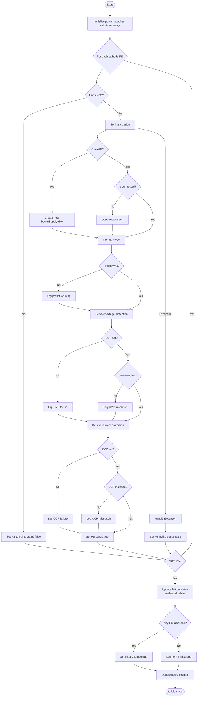
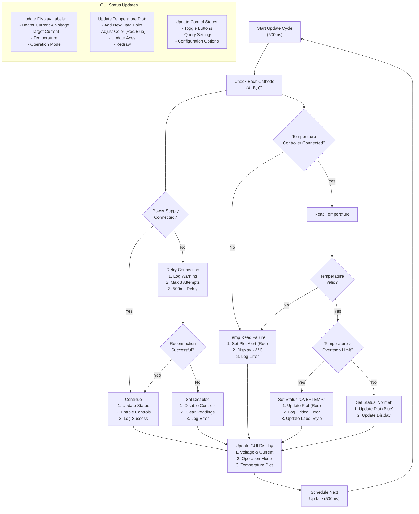
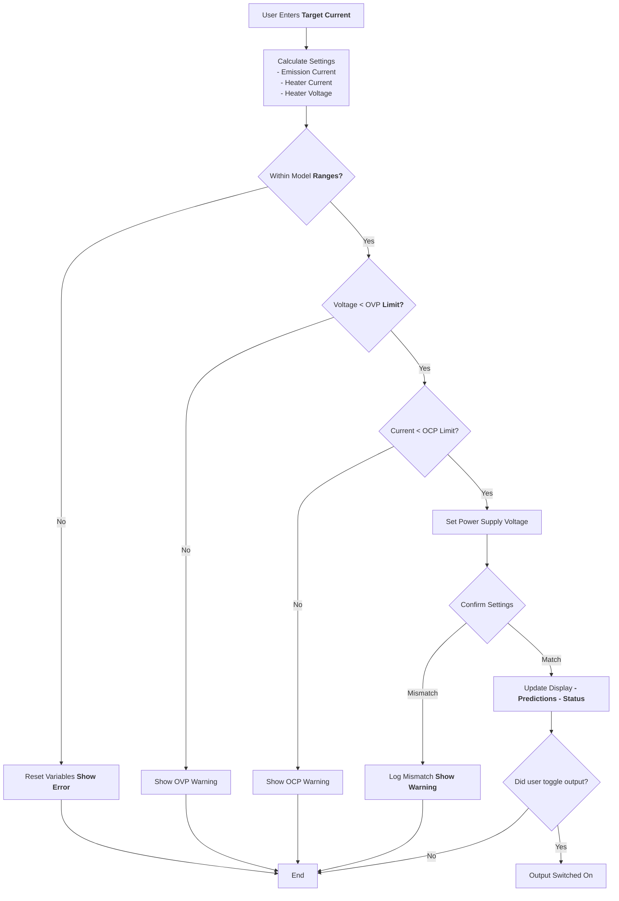
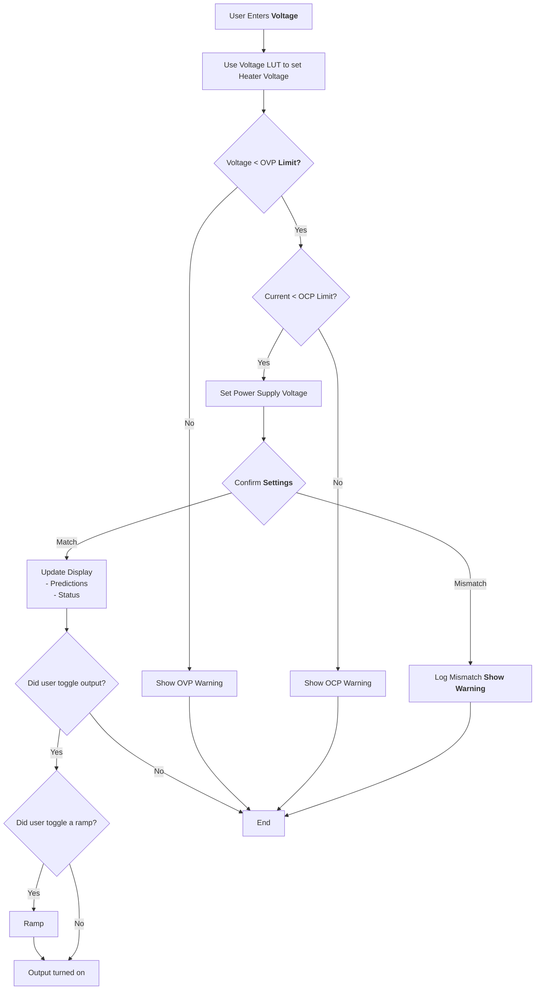

# 9104 Power Supply Initialization

# Idle State Monitoring
Parallel operations for each Cathode (A, B, C)

# Defining a target electron beam emission current
 

# Setting output via Dashboard for Benchmarking
 
