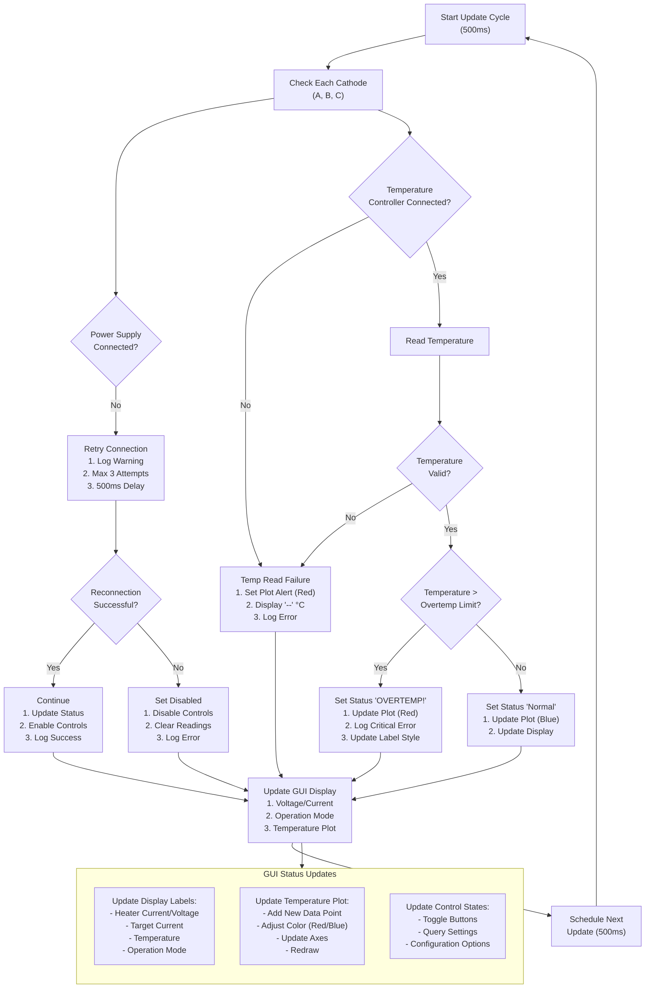
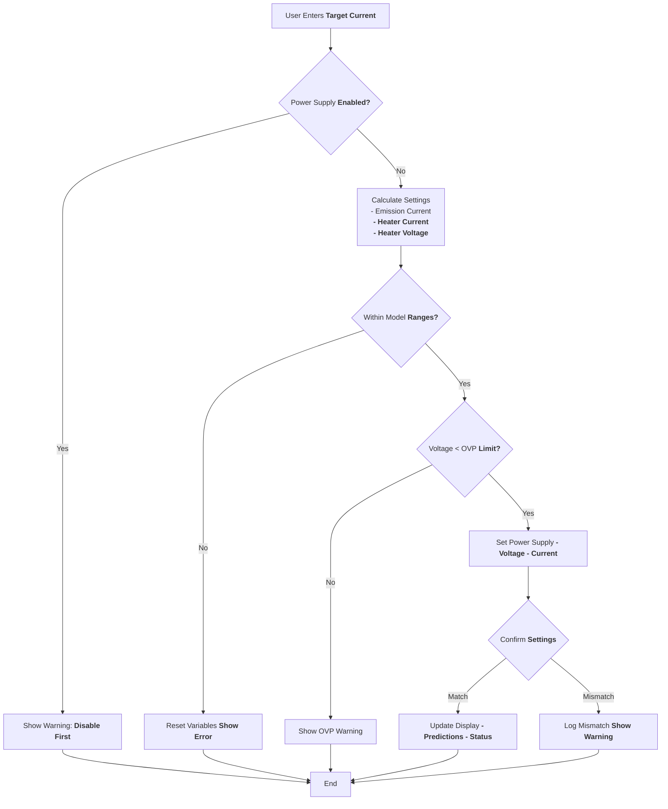

# Idle State Monitoring
Parallel operations for each Cathode (A, B, C)

```mermaid
flowchart TB
    Start["Start Update Cycle
    (500ms)"] --> ParallelCheck["Check Each Cathode
    (A, B, C)"]
    
    ParallelCheck --> PSCheck{"Power Supply
    Connected?"}
    ParallelCheck --> TempCheck{"Temperature
    Controller Connected?"}
    
    PSCheck -->|No| PSRetry["Retry Connection
    1. Log Warning
    2. Max 3 Attempts
    3. 500ms Delay"]
    PSRetry --> PSSuccess{"Reconnection
    Successful?"}
    
    PSSuccess -->|Yes| PSResume["Continue
    1. Update Status
    2. Enable Controls
    3. Log Success"]

    PSSuccess -->|No| PSFail["Set Disabled
    1. Disable Controls
    2. Clear Readings
    3. Log Error"]
    
    TempCheck -->|No| TempFail["Temp Read Failure
    1. Set Plot Alert (Red)
    2. Display '--' °C
    3. Log Error"]
    TempCheck -->|Yes| ReadTemp["Read Temperature"]
    
    ReadTemp --> ValidateTemp{"Temperature
    Valid?"}
    ValidateTemp -->|No| TempFail
    ValidateTemp -->|Yes| CheckOT{"Temperature >
    Overtemp Limit?"}
    
    CheckOT -->|Yes| OTActions[" Set Status 'OVERTEMP!'
    1. Update Plot (Red)
    2. Log Critical Error
    3. Update Label Style"]
    CheckOT -->|No| NormalTemp["Set Status 'Normal'
    1. Update Plot (Blue)
    2. Update Display"]
    
    PSResume --> UpdateDisplay["Update GUI Display
    1. Voltage/Current
    2. Operation Mode
    3. Temperature Plot"]
    PSFail --> UpdateDisplay
    OTActions --> UpdateDisplay
    NormalTemp --> UpdateDisplay
    TempFail --> UpdateDisplay
    
    UpdateDisplay --> NextCycle["Schedule Next
    Update (500ms)"]
    NextCycle --> Start
    
    subgraph GUI_Updates["GUI Status Updates"]
        direction TB
        UpdateLabels["Update Display Labels:
        - Heater Current/Voltage
        - Target Current
        - Temperature
        - Operation Mode"]
        
        UpdatePlot["Update Temperature Plot:
        - Add New Data Point
        - Adjust Color (Red/Blue)
        - Update Axes
        - Redraw"]
        
        UpdateControls["Update Control States:
        - Toggle Buttons
        - Query Settings
        - Configuration Options"]
    end
    
    UpdateDisplay --> GUI_Updates
```

# Defining a target electron beam emission current
 

```mermaid
flowchart TB
    Input["User Enters<b> Target Current"] --> ValidatePS{"Power Supply<b> Enabled?"}
    
    ValidatePS -->|Yes| Warning["Show Warning:<b> Disable First"]
    ValidatePS -->|No| Calculate["Calculate Settings
    - Emission Current<b> 
    - Heater Current
    - Heater Voltage"]
    
    Calculate --> ValidateRange{"Within Model<b> Ranges?"}
    
    ValidateRange -->|No| ResetVars["Reset Variables <b>Show Error"]
    ValidateRange -->|Yes| CheckOVP{"Voltage < OVP<b> Limit?"}
    
    CheckOVP -->|No| OVPWarn["Show OVP Warning"]
    CheckOVP -->|Yes| SetPS["Set Power Supply<b> - Voltage<b> - Current"]
    
    SetPS --> Confirm{"Confirm<b> Settings"}
    
    Confirm -->|Match| UpdateDisplay["Update Display<b> - Predictions<b> - Status"]
    Confirm -->|Mismatch| LogError["Log Mismatch<b> Show Warning"]
    
    Warning --> End["End"]
    ResetVars --> End
    OVPWarn --> End
    UpdateDisplay --> End
    LogError --> End
```