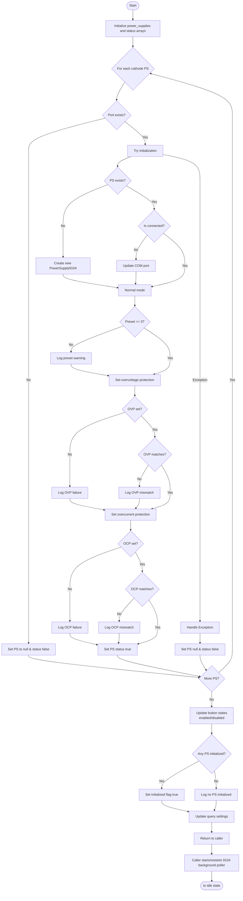
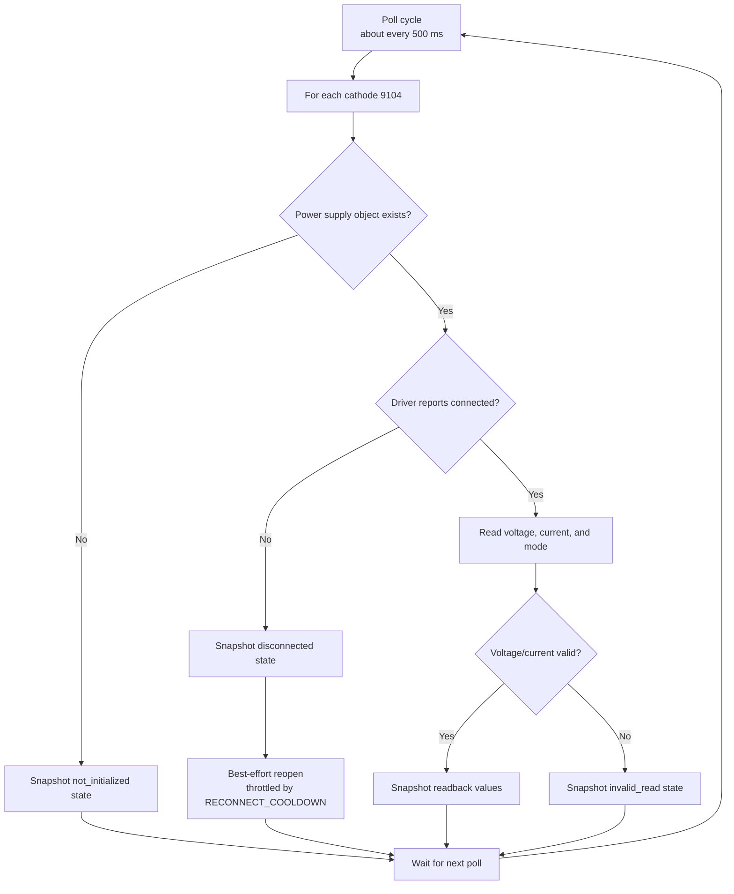
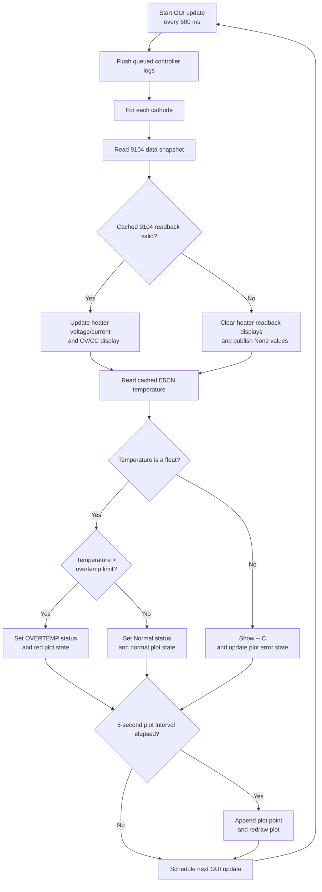
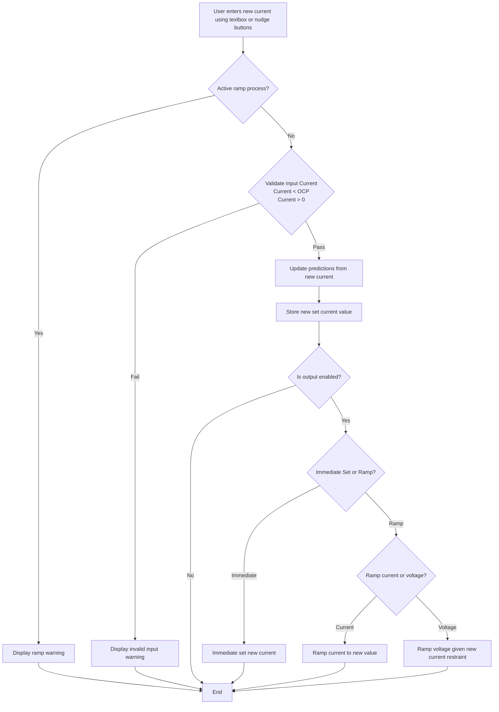
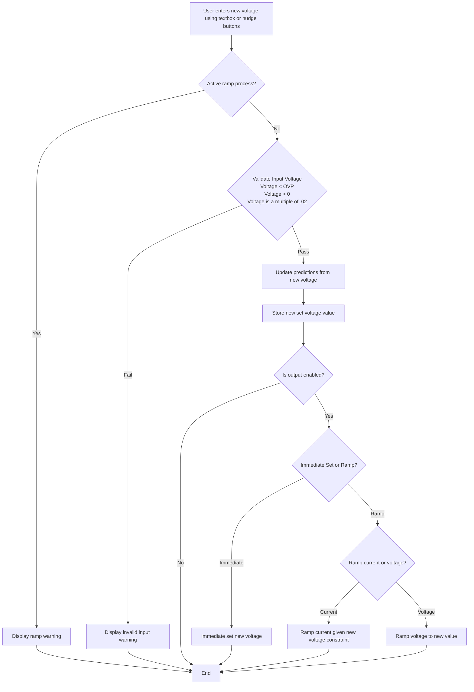

# Cathode Heating Subsystem

## Purpose

`cathode_heating.py` implements the dashboard subsystem used to operate three cathode heater channels, labeled A, B, and C.

The subsystem sits between the Tkinter GUI and the hardware drivers. It is responsible for:

- Building the cathode-heating UI.
- Managing one `PowerSupply9104` per cathode.
- Managing the temperature-controller connection.
- Validating operator-entered voltage and current requests.
- Coordinating immediate sets vs. ramped sets.
- Keeping live voltage, current, mode, and temperature displays updated.
- Polling 9104 power-supply readbacks on a background thread.

## Hardware Relationships

Each cathode channel is backed by:

- One BK Precision 9104 power supply, used for heater voltage/current control.
- One temperature-controller input, used for clamp-temperature monitoring.

The subsystem creates and stores three power-supply driver instances in `self.power_supplies`, one for each cathode.

## High-Level Behavior

At runtime the subsystem has three main jobs:

1. Build and maintain the GUI state for each cathode.
2. Send validated setpoint changes to the power supply drivers.
3. Refresh GUI values on a 500 ms Tkinter loop by consuming 9104 readbacks from a background poller.

Temperature-controller readings are still owned by the `E5CNModbus` temperature-controller object. `cathode_heating.py` reads the latest cached temperature value from `temperature_controller.temperatures[index]`.

## UI Structure Per Cathode

Each cathode frame contains:

- A `Main` tab for operator control and live readback.
- A `Config` tab for protection limits, slew rates, and status queries.

The `Main` tab includes:

- Heater current control:
  - Sent current display.
  - Goal current display.
  - Entry box and `Set` button.
  - `+0.01` and `-0.01` nudge buttons.
- Heater voltage control:
  - Sent voltage display.
  - Goal voltage display.
  - Entry box and `Set` button.
  - `+0.02` and `-0.02` nudge buttons.
- Output controls:
  - Output toggle button.
  - Output mode dropdown.
  - `STOP RAMP` button.
- Read-only displays:
  - Predicted output values.
  - Measured heater current and voltage.
  - Clamp temperature.
  - CV/CC mode indicator.
  - Temperature plot.

The `Config` tab includes:

- Overtemperature limit.
- Overvoltage protection (OVP).
- Overcurrent protection (OCP).
- Current slew rate.
- Voltage slew rate.
- Query-settings button and status readback.

## Output Modes

Each cathode has an output mode selector with three choices:

- `Immediate Set`
- `Ramp Current`
- `Ramp Voltage`

These map to the subsystem state:

- `self.ramp_status[index]`
- `self.ramp_control_mode[index]`

### Immediate Set

When output is already on:

- Current changes call `set_current(...)` directly.
- Voltage changes call `set_voltage(...)` directly.

When output is turned on:

- The subsystem requires both a stored target current and target voltage.
- It enables the output and then sends both setpoints immediately.

### Ramp Current

When output is turned on:

- The subsystem immediately sets the target voltage.
- It then ramps current from the present measured current to the stored target current.

When the operator changes current while output is already on:

- The subsystem ramps current to the new target.

When the operator changes voltage while output is already on:

- The subsystem immediately updates voltage, then ramps current back toward the stored current target.

### Ramp Voltage

When output is turned on:

- The subsystem immediately sets the target current.
- It then ramps voltage from the present measured voltage to the stored target voltage.

When the operator changes voltage while output is already on:

- The subsystem ramps voltage to the new target.

When the operator changes current while output is already on:

- The subsystem immediately updates current, then ramps voltage back toward the stored voltage target.

## Validation Rules

Before sending a new setpoint, the subsystem validates it against current driver and hardware assumptions.

### Voltage Validation

`validate_voltage()` checks that:

- The requested voltage is not negative.
- The requested voltage does not exceed the current OVP setting.
- The requested voltage is a multiple of 0.02 V.

### Current Validation

`validate_current()` checks that:

- The requested current is not negative.
- The requested current does not exceed the current OCP setting.

### Output Enable Validation

When the output toggle is switched on, `toggle_output()` also verifies:

- A stored target voltage exists.
- A stored target current exists.
- The stored target voltage is within OVP.
- The stored target current is within OCP.

If any of those checks fail, output is not enabled.

## Ramping Behavior

The subsystem delegates actual ramp execution to `PowerSupply9104.ramp_current()` and `PowerSupply9104.ramp_voltage()`.

The subsystem also manages GUI state during ramps:

- Disables adjustment buttons and text-entry set buttons.
- Disables the output-mode dropdown.
- Enables the `STOP RAMP` button.
- Re-enables controls when the ramp completes or is stopped.

Important helpers:

- `is_ramping()`
- `on_ramp_start()`
- `on_ramp_complete()`
- `stop_ramp()`

`STOP RAMP` signals the driver to stop the active ramp thread through `PowerSupply9104.stop_ramp()`.

## Sent vs Goal vs Measured Values

The UI tracks three different kinds of values:

- Sent values:
  - Last values sent to the power supply during direct sets or ramp steps.
  - Updated through callbacks from the power-supply driver.
- Goal values:
  - Operator-requested targets stored in the subsystem.
  - Shown as the intended current and voltage for the channel.
- Measured values:
  - Latest readback from the 9104 polling thread.
  - Voltage, current, mode, connection state, and read errors are stored in `self.power_supply_readbacks`.
  - `update_data()` reads that latest readback snapshot instead of calling `get_voltage_current_mode()` from the Tkinter thread.

This separation is useful during ramps because the sent value can change step-by-step before the measured value settles.

## Data Refresh Loop

`update_data()` is the main GUI refresh loop. It runs every 500 ms and, for each cathode:

- Flushes queued logs from the temperature controller and power-supply drivers.
- Reads the latest 9104 voltage, current, and CV/CC mode snapshot.
- Marks power-supply readbacks unavailable when the snapshot says the supply is disconnected or the read is invalid.
- Publishes valid heater current and voltage readbacks to the logger.
- Reads the latest clamp temperature data from the temperature-controller interface.
- Updates overtemperature state and plot color.
- Appends plot data on the plot interval.
- Schedules the next update with `self.parent.after(500, self.update_data)`.

## 9104 Readback Polling Thread

Routine BK Precision 9104 readbacks are handled by `Cathode9104Poller`, started by `start_power_supply_polling()`.

The poller:

- Runs independently of the Tkinter event loop.
- Polls each configured 9104 roughly every 500 ms.
- Calls `PowerSupply9104.get_voltage_current_mode()` from the background thread.
- Writes a small snapshot into `self.power_supply_readbacks` under `self.power_supply_readback_lock`.
- Uses the existing `PowerSupply9104.serial_lock`, so regular commands and readback polling still serialize through the driver.
- Marks disconnected, uninitialized, and invalid-read states in the snapshot.
- Performs best-effort reconnects for disconnected existing supply objects, throttled by `RECONNECT_COOLDOWN`.

COM-port changes and shutdown call `stop_power_supply_polling()` before disconnecting or closing serial ports.

## Protection and Configuration Handling

Key configuration methods include:

- `set_overvoltage_limit()`
- `set_overcurrent_limit()`
- `set_overtemp_limit()`
- `set_slew_rate()`
- `query_and_check_settings()`

These methods are responsible for writing protection settings to the supply, reading them back, and logging mismatches or failures.

## Modeling and Predicted Output

The subsystem still initializes cathode models in `init_cathode_model()` for:

- Heater current to heater voltage.
- Heater current to emission current.
- Heater current to true temperature.

Manual setpoint handlers now actively update predictions before applying output changes:

- `on_current_label_click()`
- `on_voltage_label_click()`
- `adjust_current()`
- `adjust_voltage()`

Those handlers call either `update_predictions_from_current()` or `update_predictions_from_voltage()` after validation. LUT selector changes call `refresh_predictions()`, which recomputes predictions from the currently requested setpoint when one exists.

The prediction path is still display-side guidance. Output behavior is still governed by validation, output state, and the selected immediate/ramp mode.

## Main Methods To Read First

If you are trying to understand the file quickly, start with these methods:

- `__init__()`
- `initialize_power_supplies()`
- `start_power_supply_polling()`
- `_power_supply_polling_loop()`
- `_get_power_supply_readback()`
- `update_data()`
- `read_temperature()`
- `toggle_output()`
- `on_current_label_click()`
- `on_voltage_label_click()`
- `update_output_from_current()`
- `update_output_from_voltage()`
- `validate_current()`
- `validate_voltage()`
- `set_ramp_mode()`
- `stop_ramp()`
- `close_com_ports()`

## Relationship To `power_supply_9104.py`

`cathode_heating.py` is the subsystem/orchestration layer.

It decides:

- What the operator is asking for.
- Whether the request is valid.
- Which control mode is active.
- Which driver call to issue next.

`power_supply_9104.py` is the instrument-driver layer.

It handles:

- Serial communication.
- Command formatting.
- Protection-setting commands.
- Direct set commands.
- Serialized readback commands used by the cathode polling thread.
- Background ramp threads.
- Ramp stop signaling.
- Bounded serial-lock waits during shutdown, through optional `lock_timeout` arguments on selected calls.

In short:

- `cathode_heating.py` decides what should happen.
- `cathode_heating.py` owns the 9104 readback polling/cache used by the GUI.
- `power_supply_9104.py` performs the hardware I/O and protects each serial port with its own lock.

## Plot Color and Temperature Logging

`read_temperature()` updates plot color state through `set_plot_color()`.

To avoid extra redraw/log churn:

- `set_plot_color()` tracks the current color/error state per cathode and returns early if the state has not changed.
- Color-state changes still redraw the affected plot immediately.
- Disconnected temperature-controller logs are throttled by `self.log_interval`.
- Normal plot data redraws still happen through `update_plot()` on the 5-second plot interval.

Temperature-controller polling itself remains in `E5CNModbus`; this subsystem just reads the latest temperature values.

## Shutdown Behavior

`close_com_ports()` performs shutdown in this order:

1. Cancel the scheduled Tkinter `update_data()` callback.
2. Stop the `Cathode9104Poller` thread.
3. Signal any active 9104 ramp threads to stop.
4. Attempt to disable each power-supply output with a bounded serial-lock wait.
5. Close each power-supply serial connection with bounded waits.
6. Stop and disconnect the E5CN temperature controller.

The bounded waits prevent a dead serial transaction from hanging dashboard exit indefinitely.

# 9104 Power Supply Initialization

```mermaid
flowchart TB
    Start([Start]) --> InitArrays[Initialize power_supplies and status arrays]
    InitArrays --> LoopStart{For each cathode PS}
    
    LoopStart --> HasPort{Port exists?}
    HasPort -- No --> SetNull[Set PS to null & status false]
    HasPort -- Yes --> TryInit[Try initialization]
    
    TryInit --> PSExists{PS exists?}
    PSExists -- No --> CreatePS[Create new PowerSupply9104]
    PSExists -- Yes --> CheckConnection{Is connected?}
    
    CheckConnection -- No --> UpdatePort[Update COM port]
    CheckConnection -- Yes --> SetPreset[Normal mode]
    CreatePS --> SetPreset
    UpdatePort --> SetPreset
    
    SetPreset --> ConfirmPreset{Preset == 3?}
    ConfirmPreset -- No --> LogPresetWarning[Log preset warning]
    ConfirmPreset -- Yes --> SetOVP[Set overvoltage protection]
    LogPresetWarning --> SetOVP
    
    SetOVP --> OVPSuccess{OVP set?}
    OVPSuccess -- No --> LogOVPFail[Log OVP failure]
    OVPSuccess -- Yes --> ConfirmOVP{OVP matches?}
    
    ConfirmOVP -- No --> LogOVPMismatch[Log OVP mismatch]
    ConfirmOVP -- Yes --> SetOCP[Set overcurrent protection]
    LogOVPMismatch --> SetOCP
    LogOVPFail --> SetOCP
    
    SetOCP --> OCPSuccess{OCP set?}
    OCPSuccess -- No --> LogOCPFail[Log OCP failure]
    OCPSuccess -- Yes --> ConfirmOCP{OCP matches?}
    
    ConfirmOCP -- No --> LogOCPMismatch[Log OCP mismatch]
    ConfirmOCP -- Yes --> SetSuccess[Set PS status true]
    LogOCPMismatch --> SetSuccess
    LogOCPFail --> SetSuccess
    
    SetSuccess --> NextPS{More PS?}
    SetNull --> NextPS
    
    NextPS -- Yes --> LoopStart
    NextPS -- No --> UpdateButtons["Update button states
    enabled/disabled"]
    
    UpdateButtons --> CheckAnyInit{Any PS initialized?}
    CheckAnyInit -- Yes --> SetInitTrue[Set initialized flag true]
    CheckAnyInit -- No --> LogNoInit[Log no PS initialized]
    
    SetInitTrue --> UpdateSettings[Update query settings]
    LogNoInit --> UpdateSettings
    
    UpdateSettings --> ReturnInit[Return to caller]
    ReturnInit --> StartPoller[Caller starts/restarts 9104 background poller]
    StartPoller --> End([to idle state])
    
    Error[Handle Exception] --> SetErrorState[Set PS null & status false]
    SetErrorState --> NextPS
    
    TryInit -- Exception --> Error
```

# Idle State Monitoring
The cathode subsystem has two repeating paths while idle:

- `Cathode9104Poller` reads 9104 power-supply state off the Tkinter thread.
- `update_data()` runs on the Tkinter thread and updates GUI state from cached values.

Cathode9104Poller background thread:

```mermaid
flowchart TB
    PollStart["Poll cycle
    about every 500 ms"] --> PollEach["For each cathode 9104"]
    PollEach --> HasPS{"Power supply object exists?"}
    HasPS -- No --> SnapshotNotInit["Snapshot not_initialized state"]
    HasPS -- Yes --> Connected{"Driver reports connected?"}
    Connected -- No --> SnapshotDisconnected["Snapshot disconnected state"]
    SnapshotDisconnected --> Reopen["Best-effort reopen
    throttled by RECONNECT_COOLDOWN"]
    Connected -- Yes --> Read9104["Read voltage, current, and mode"]
    Read9104 --> ReadValid{"Voltage/current valid?"}
    ReadValid -- Yes --> SnapshotGood["Snapshot readback values"]
    ReadValid -- No --> SnapshotInvalid["Snapshot invalid_read state"]
    SnapshotGood --> PollWait["Wait for next poll"]
    SnapshotInvalid --> PollWait
    SnapshotNotInit --> PollWait
    Reopen --> PollWait
    PollWait --> PollStart
```

Tkinter `update_data()` loop:

```mermaid
flowchart TB
    Start["Start GUI update
    every 500 ms"] --> FlushLogs["Flush queued controller logs"]
    FlushLogs --> EachCathode["For each cathode"]
    EachCathode --> ReadCache["Read 9104 data snapshot"]
    ReadCache --> CacheOK{"Cached 9104 readback valid?"}
    CacheOK -- Yes --> UpdatePS["Update heater voltage/current
    and CV/CC display"]
    CacheOK -- No --> ClearPS["Clear heater readback displays
    and publish None values"]

    UpdatePS --> ReadTemp["Read cached E5CN temperature"]
    ClearPS --> ReadTemp
    ReadTemp --> TempValid{"Temperature is a float?"}
    TempValid -- No --> TempUnavailable["Show -- C
    and update plot error state"]
    TempValid -- Yes --> CheckOT{"Temperature >
    overtemp limit?"}
    CheckOT -- Yes --> OTActions["Set OVERTEMP status
    and red plot state"]
    CheckOT -- No --> NormalTemp["Set Normal status
    and normal plot state"]

    OTActions --> PlotCheck{"5-second plot interval elapsed?"}
    NormalTemp --> PlotCheck
    TempUnavailable --> PlotCheck
    PlotCheck -- Yes --> UpdatePlot["Append plot point
    and redraw plot"]
    PlotCheck -- No --> ScheduleNext["Schedule next GUI update"]
    UpdatePlot --> ScheduleNext
    ScheduleNext --> Start
```

# Setting current output via dashboard
 

```mermaid
flowchart TB
    Input["User enters new current using textbox or nudge buttons"] --> ActiveRamp{"Active ramp process?"}

    ActiveRamp -->|No| ValidateCurrent{"Validate Input Current
                                        Current < OCP
                                        Current > 0"}
    ActiveRamp -->|Yes| RampWarn["Display ramp warning"]

    RampWarn --> End

    ValidateCurrent -->|Fail| DispWarn["Display invalid input warning"]
    ValidateCurrent -->|Pass| UpdatePredictions["Update predictions from new current"]

    DispWarn --> End

    UpdatePredictions --> StoreCurrent["Store new set current value"]

    StoreCurrent --> UpdateOutput{"Is output enabled?"}

    UpdateOutput -->|No| End
    UpdateOutput -->|Yes| OutputMode{"Immediate Set or Ramp?"}

    OutputMode -->|Immediate| SetOutput["Immediate set new current"]
    OutputMode -->|Ramp| RampMode{"Ramp current or voltage?"}

    SetOutput --> End

    RampMode -->|Current| RampCurrent["Ramp current to new value"]
    RampMode -->|Voltage| RampVoltage["Ramp voltage given new current restraint"]

    RampCurrent --> End
    RampVoltage --> End
```

# Setting voltage output via dashboard 
 

```mermaid
flowchart TB
    Input["User enters new voltage using textbox or nudge buttons"] --> ActiveRamp{"Active ramp process?"}

    ActiveRamp -->|No| ValidateVoltage{"Validate Input Voltage
                                        Voltage < OVP
                                        Voltage > 0
                                        Voltage is a multiple of .02"}
    ActiveRamp -->|Yes| RampWarn["Display ramp warning"]

    RampWarn --> End

    ValidateVoltage -->|Fail| DispWarn["Display invalid input warning"]
    ValidateVoltage -->|Pass| UpdatePredictions["Update predictions from new voltage"]

    DispWarn --> End

    UpdatePredictions --> StoreVoltage["Store new set voltage value"]

    StoreVoltage --> UpdateOutput{"Is output enabled?"}

    UpdateOutput -->|No| End
    UpdateOutput -->|Yes| OutputMode{"Immediate Set or Ramp?"}

    OutputMode -->|Immediate| SetOutput["Immediate set new voltage"]
    OutputMode -->|Ramp| RampMode{"Ramp current or voltage?"}

    SetOutput --> End

    RampMode -->|Current| RampCurrent["Ramp current given new voltage constraint"]
    RampMode -->|Voltage| RampVoltage["Ramp voltage to new value"]

    RampCurrent --> End
    RampVoltage --> End
```
