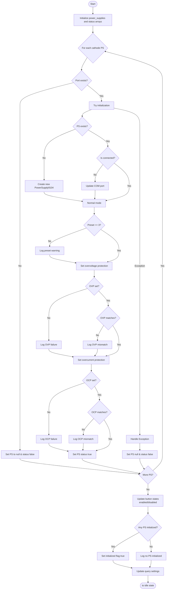
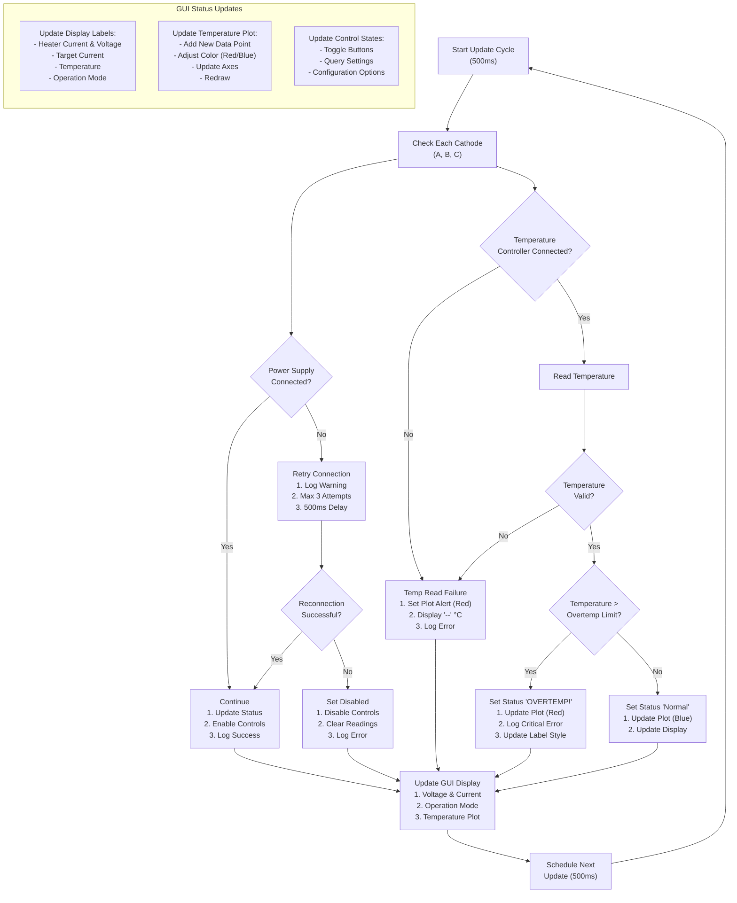
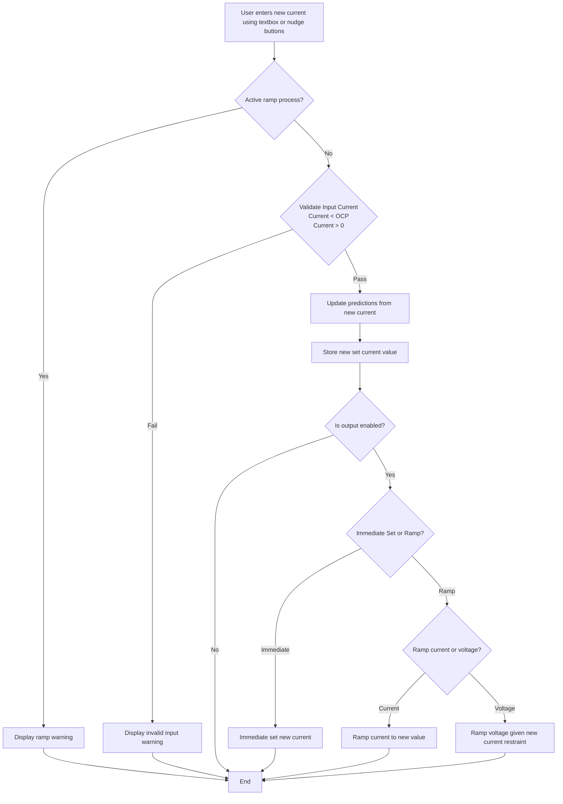
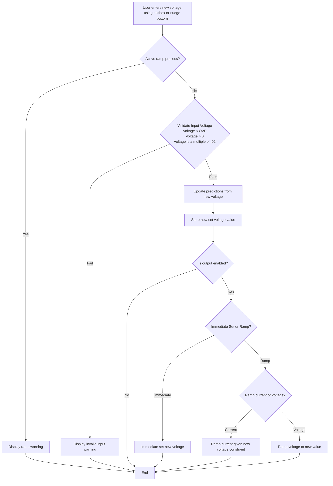

# 9104 Power Supply Initialization

```mermaid
flowchart TB
    Start([Start]) --> InitArrays[Initialize power_supplies and status arrays]
    InitArrays --> LoopStart{For each cathode PS}
    
    LoopStart --> HasPort{Port exists?}
    HasPort -- No --> SetNull[Set PS to null & status false]
    HasPort -- Yes --> TryInit[Try initialization]
    
    TryInit --> PSExists{PS exists?}
    PSExists -- No --> CreatePS[Create new PowerSupply9104]
    PSExists -- Yes --> CheckConnection{Is connected?}
    
    CheckConnection -- No --> UpdatePort[Update COM port]
    CheckConnection -- Yes --> SetPreset[Normal mode]
    CreatePS --> SetPreset
    UpdatePort --> SetPreset
    
    SetPreset --> ConfirmPreset{Preset == 3?}
    ConfirmPreset -- No --> LogPresetWarning[Log preset warning]
    ConfirmPreset -- Yes --> SetOVP[Set overvoltage protection]
    LogPresetWarning --> SetOVP
    
    SetOVP --> OVPSuccess{OVP set?}
    OVPSuccess -- No --> LogOVPFail[Log OVP failure]
    OVPSuccess -- Yes --> ConfirmOVP{OVP matches?}
    
    ConfirmOVP -- No --> LogOVPMismatch[Log OVP mismatch]
    ConfirmOVP -- Yes --> SetOCP[Set overcurrent protection]
    LogOVPMismatch --> SetOCP
    LogOVPFail --> SetOCP
    
    SetOCP --> OCPSuccess{OCP set?}
    OCPSuccess -- No --> LogOCPFail[Log OCP failure]
    OCPSuccess -- Yes --> ConfirmOCP{OCP matches?}
    
    ConfirmOCP -- No --> LogOCPMismatch[Log OCP mismatch]
    ConfirmOCP -- Yes --> SetSuccess[Set PS status true]
    LogOCPMismatch --> SetSuccess
    LogOCPFail --> SetSuccess
    
    SetSuccess --> NextPS{More PS?}
    SetNull --> NextPS
    
    NextPS -- Yes --> LoopStart
    NextPS -- No --> UpdateButtons[Update button states
    enabled/disabled]
    
    UpdateButtons --> CheckAnyInit{Any PS initialized?}
    CheckAnyInit -- Yes --> SetInitTrue[Set initialized flag true]
    CheckAnyInit -- No --> LogNoInit[Log no PS initialized]
    
    SetInitTrue --> UpdateSettings[Update query settings]
    LogNoInit --> UpdateSettings
    
    UpdateSettings --> End([to idle state])
    
    Error[Handle Exception] --> SetErrorState[Set PS null & status false]
    SetErrorState --> NextPS
    
    TryInit -- Exception --> Error
```

# Idle State Monitoring
Parallel operations for each Cathode (A, B, C)

```mermaid
flowchart TB
    Start["Start Update Cycle
    (500ms)"] --> ParallelCheck["Check Each Cathode
    (A, B, C)"]
    
    ParallelCheck --> PSCheck{"Power Supply
    Connected?"}
    ParallelCheck --> TempCheck{"Temperature
    Controller Connected?"}
    
    PSCheck -->|Yes| PSResume
    PSCheck -->|No| PSRetry["Retry Connection
    1. Log Warning
    2. Max 3 Attempts
    3. 500ms Delay"]
    PSRetry --> PSSuccess{"Reconnection
    Successful?"}
    
    PSSuccess -->|Yes| PSResume["Continue
    1. Update Status
    2. Enable Controls
    3. Log Success"]

    PSSuccess -->|No| PSFail["Set Disabled
    1. Disable Controls
    2. Clear Readings
    3. Log Error"]
    
    TempCheck -->|No| TempFail["Temp Read Failure
    1. Set Plot Alert (Red)
    2. Display '--' °C
    3. Log Error"]
    TempCheck -->|Yes| ReadTemp["Read Temperature"]
    
    ReadTemp --> ValidateTemp{"Temperature
    Valid?"}
    ValidateTemp -->|No| TempFail
    ValidateTemp -->|Yes| CheckOT{"Temperature >
    Overtemp Limit?"}
    
    CheckOT -->|Yes| OTActions[" Set Status 'OVERTEMP!'
    1. Update Plot (Red)
    2. Log Critical Error
    3. Update Label Style"]
    CheckOT -->|No| NormalTemp["Set Status 'Normal'
    1. Update Plot (Blue)
    2. Update Display"]
    
    PSResume --> UpdateDisplay["Update GUI Display
    1. Voltage & Current
    2. Operation Mode
    3. Temperature Plot"]
    PSFail --> UpdateDisplay
    OTActions --> UpdateDisplay
    NormalTemp --> UpdateDisplay
    TempFail --> UpdateDisplay
    
    UpdateDisplay --> NextCycle["Schedule Next
    Update (500ms)"]
    
    NextCycle --> Start
    
    subgraph GUI_Updates["GUI Status Updates"]
        direction TB
        UpdateLabels["Update Display Labels:
        - Heater Current & Voltage
        - Target Current
        - Temperature
        - Operation Mode"]
        
        UpdatePlot["Update Temperature Plot:
        - Add New Data Point
        - Adjust Color (Red/Blue)
        - Update Axes
        - Redraw"]
        
        UpdateControls["Update Control States:
        - Toggle Buttons
        - Query Settings
        - Configuration Options"]
    end
```

# Setting current output via dashboard
 

```mermaid
flowchart TB
    Input["User enters new current using textbox or nudge buttons"] --> ActiveRamp{"Active ramp process?"}

    ActiveRamp -->|No| ValidateCurrent{"Validate Input Current
                                        Current < OCP
                                        Current > 0"}
    ActiveRamp -->|Yes| RampWarn["Display ramp warning"]

    RampWarn --> End

    ValidateCurrent -->|Fail| DispWarn["Display invalid input warning"]
    ValidateCurrent -->|Pass| UpdatePredictions["Update predictions from new current"]

    DispWarn --> End

    UpdatePredictions --> StoreCurrent["Store new set current value"]

    StoreCurrent --> UpdateOutput{"Is output enabled?"}

    UpdateOutput -->|No| End
    UpdateOutput -->|Yes| OutputMode{"Immediate Set or Ramp?"}

    OutputMode -->|Immediate| SetOutput["Immediate set new current"]
    OutputMode -->|Ramp| RampMode{"Ramp current or voltage?"}

    SetOutput --> End

    RampMode -->|Current| RampCurrent["Ramp current to new value"]
    RampMode -->|Voltage| RampVoltage["Ramp voltage given new current restraint"]

    RampCurrent --> End
    RampVoltage --> End
```

# Setting voltage output via dashboard 
 

```mermaid
flowchart TB
    Input["User enters new voltage using textbox or nudge buttons"] --> ActiveRamp{"Active ramp process?"}

    ActiveRamp -->|No| ValidateVoltage{"Validate Input Voltage
                                        Voltage < OVP
                                        Voltage > 0
                                        Voltage is a multiple of .02"}
    ActiveRamp -->|Yes| RampWarn["Display ramp warning"]

    RampWarn --> End

    ValidateVoltage -->|Fail| DispWarn["Display invalid input warning"]
    ValidateVoltage -->|Pass| UpdatePredictions["Update predictions from new voltage"]

    DispWarn --> End

    UpdatePredictions --> StoreVoltage["Store new set voltage value"]

    StoreVoltage --> UpdateOutput{"Is output enabled?"}

    UpdateOutput -->|No| End
    UpdateOutput -->|Yes| OutputMode{"Immediate Set or Ramp?"}

    OutputMode -->|Immediate| SetOutput["Immediate set new voltage"]
    OutputMode -->|Ramp| RampMode{"Ramp current or voltage?"}

    SetOutput --> End

    RampMode -->|Current| RampCurrent["Ramp current given new voltage constraint"]
    RampMode -->|Voltage| RampVoltage["Ramp voltage to new value"]

    RampCurrent --> End
    RampVoltage --> End
```