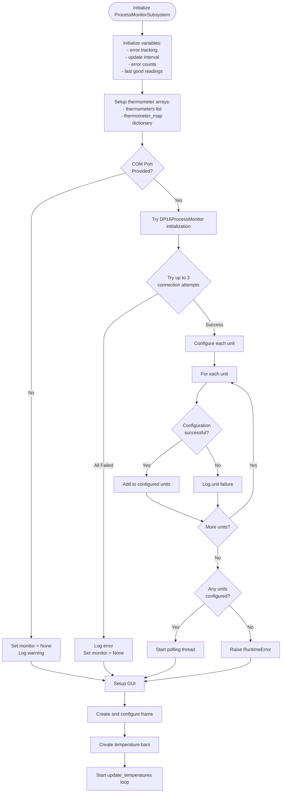
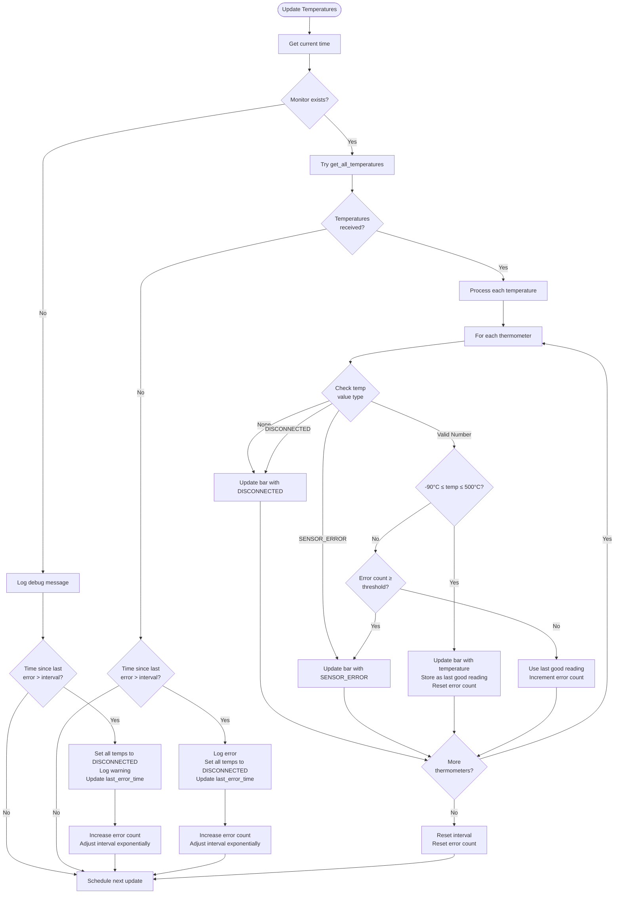
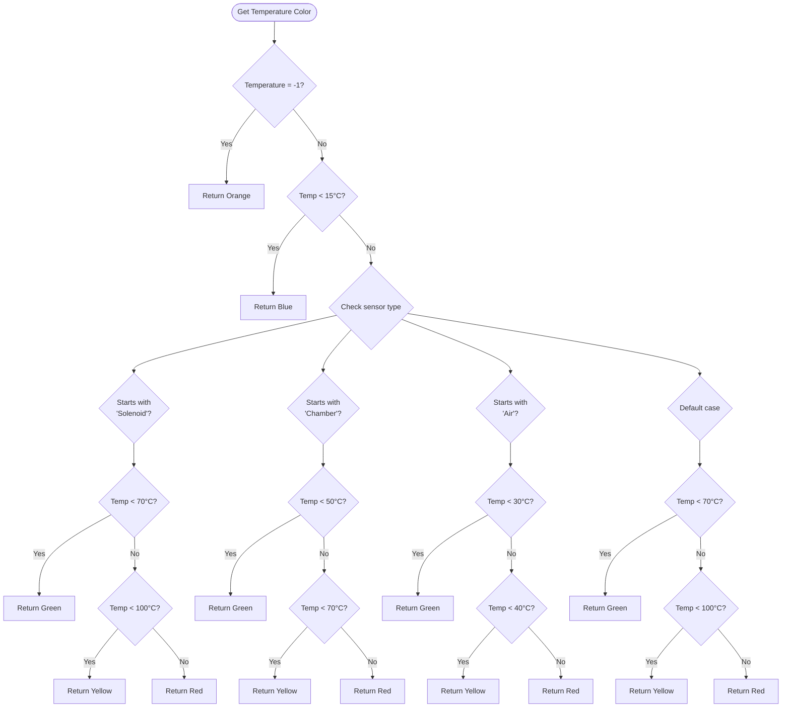

# Process Monitor Subsystem

## Overview

The Process Monitor Subsystem is a real-time temperature monitoring system that interfaces with Omega iSeries DP16PT Process Monitors via Modbus RTU. It provides visual representation of temperature data captured from multiple experimental locations including:
- **Solenoid 1**
- **Solenoid 2**
- **Chamber Bottom**
- **Chamber Top**
- **Air temp** 

## Process Monitor Subsystem Class
### Overview:
Mainly used to inatlized and start Temperatrue Bar objects and to establish communictions via the DP16 driver.
### Important Method(s)
#### update_temperatures():
This method communicates directly to the driver to collect the data needed to update the visual representation of the themature data.
The expected return value is a dictionary, with the unit number being the key (1-6) and the tempature values being the value. Whatever is retuned from the driver(expected or unexpected), this method iteratviely udpates each of the corresponding thermonitors.

## Temperature Bar Class
### Overview
When called created a thermointor with the given specs. This method was created due to the fact that our different locations are expected to have different ranges of expected temperatures. This class does not handle any of the data parsing, it only displays/updates, in numeric, color, and bar data.

### Solenoid Temperature Ranges (0-120°C)
- Normal: < 70°C (Green)
- Warning: 70-100°C (Yellow)
- Critical: > 100°C (Red)

### Chamber Temperature Ranges (0-100°C)
- Normal: < 50°C (Green)
- Warning: 50-70°C (Yellow)
- Critical: > 70°C (Red)

### Air Temperature Ranges (0-50°C)
- Normal: < 30°C (Green)
- Warning: 30-40°C (Yellow)
- Critical: > 40°C (Red)

&nbsp;

## Flow Charts for process_monitor.py

### Subsystem Initialization

### `update_temperatures` Loop

Temperature Color Logic

