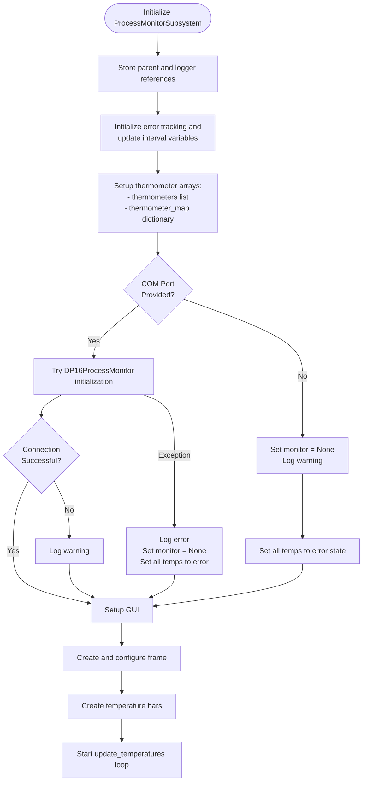
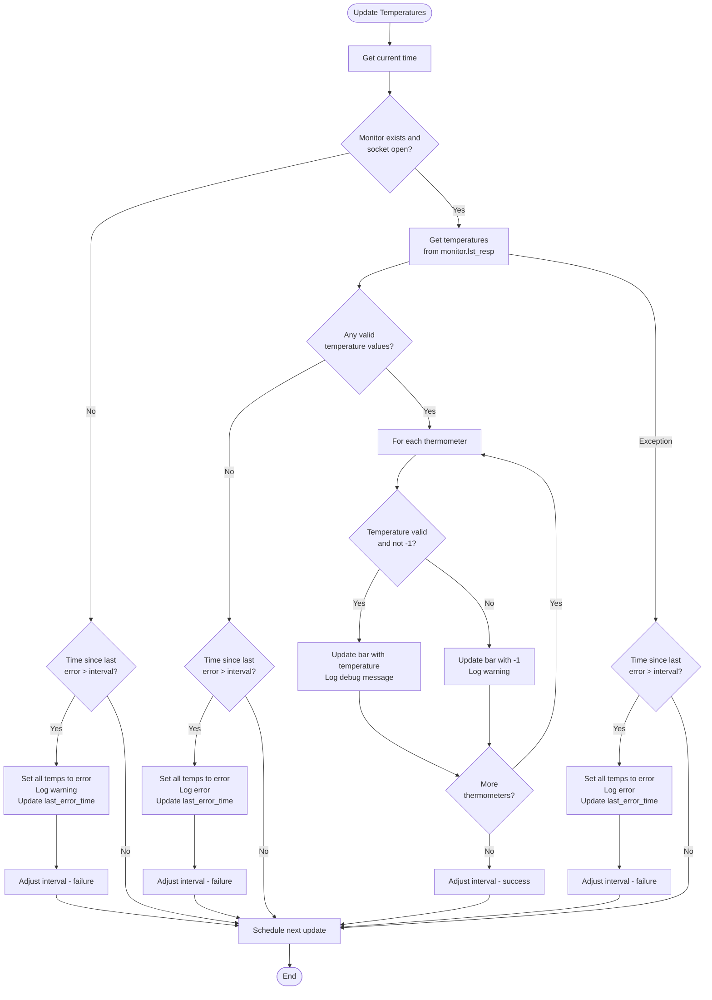

# Process Monitor Subsystem

## Overview

The Process Monitor Subsystem is a real-time temperature monitoring system that interfaces with Omega iSeries DP16PT Process Monitors via Modbus RTU. It provides visual representation of temperature data captured from multiple experimental locations including:
- **Solenoid 1**
- **Solenoid 2**
- **Chamber Bottom**
- **Chamber Top**
- **Air temp** 

## Temperature Ranges and Alerts
### Solenoid Temperature Ranges (0-120°C)
- Normal: < 70°C (Green)
- Warning: 70-100°C (Yellow)
- Critical: > 100°C (Red)

### Chamber Temperature Ranges (0-100°C)
- Normal: < 50°C (Green)
- Warning: 50-70°C (Yellow)
- Critical: > 70°C (Red)

### Air Temperature Ranges (0-50°C)
- Normal: < 30°C (Green)
- Warning: 30-40°C (Yellow)
- Critical: > 40°C (Red)

## Key Components

This application mainly consists of the following key components -

- **TemperatureBar Class**: The `TemperatureBar Class` is responsible for creating and updating the visual representation of temperature data for each sensor. It instantiates a constructor that inherits from tk.canvas and sets the attributes - name, height, width, bar_width, and value. The update_value method within this class is called with the updated temperatures of all the units. It is mainly called on the bar corresponding to the sensor whose temperature is to be updated. Upon being called, the bar for that particular sensor is deleted and a new bar is recreated which is scaled and colored based on the updated temperatures returned by the temp_bars disctionary. 

- **ProcessMonitorSusbsystem Class**: The `ProcessMonitorSubsystem Class` is responsible for calling the parent tkinter frame. It instantiates a DP16ProcessMonitor object. If the DP16Monitor object fails to connect via the RS-485 port, i.e., if the connect method in the `DP16_process_monitor` class fails to execute, the logger throws a warning message mentioning the same. 

    The `setup_gui` method within this class is responsible for the initial setup of the GUI. It instantiates and places the TemperatureBar objects within the parent frame for readily displaying the real-time temperature status of the monitored units, when the class is instantiated. 

    The `update_temperatures` method within this class communicates with the driver file to retrieve the updated temperatures of all the units. The retireved temperatures are stored in the form of a dictionary with the key corresponding to the unit numbers of the sensors and the value correcponding to their respective temperatures. The `thermometer_maps` dictionary, initialized within the constructor, is utilized to retrieve the name of the sensor corresponding to the particular unit numbers. The bar graph for that particular sensor is then updated to the new temperature value retrieved from the driver file. 

- **DP16_process_monitor.py**: The main method being utilized from the driver file (`DP16_process_monitor.py`) is the `update_temperature` method. This method primarily updates a dictionary called the `lst_resp` dictionary, which is returned by the `last_response` method in the driver file. The `lst_resp` dictionary is updated with temperature values based on the following constraints:

    1) **Modbus connection must be open**: The connection is checked before attempting any read or write operations. If the connection is not open, it 
         is re-established, and the method retries.

    2) **STATUS_REG reads 6 from the status registers**: A value of 6 indicates normal operation. Any other value is treated as an abnormal state, and 
         the state of the corresponding unit is logged as -1 in the lst_resp dictionary.

    3) **Temperatures are read from the process value registers**: These readings are converted from raw Modbus register values into 32-bit floating- 
         point numbers to represent the temperature accurately.

    4) **Temperature validation**: Temperatures read from the process value registers are further validated to be within the range of -90°C to 500°C. 
         If a temperature is outside this range, it is stored as None.

The temperature for a particular unit is retrieved from the `lst_resp` dictionary, which is updated in real-time by the `update_temperature` method in the driver file. Using this dictionary, the temperatures for the units are updated based on the stored values.

&nbsp;

## Flow Charts for process_monitor.py

### Subsystem Initialization

### `update_temperatures` Loop

Temperature Color Logic

