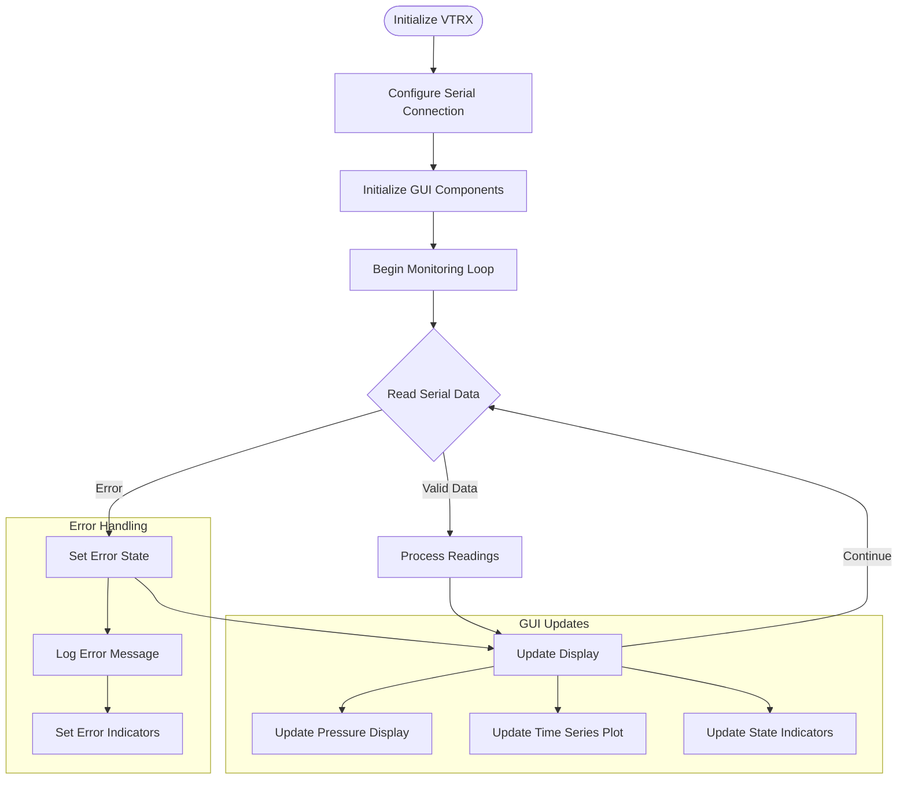

# VTRX Subsystem

## Overview

The VTRX (Vacuum Electronics) subsystem provides real-time monitoring and visualization of vacuum system pressure and component states. It interfaces with a microcontroller in the VTRX system and uses serial communication to track pressure readings, valve states, and system safety conditions.

## Key Components
### Hardware Interface
- Serial COM with VTRX chassis
- 9600 baud

### Input serial Data Packet
Parser expects semicolon-separated string containing at least three fields:
1. pressure value (float)
2. raw pressure string (scientific notation)
3. switch states in binary format
4. Optional additional error messages

### Data Retention and Time Window
The subsystem maintains a rolling buffer of pressure readings with the following characteristics:
- Max history: 168 hours (1 week)
- Data points are automatically trimmed beyond this window

### GUI Elements
- Real-time pressure plotting with configurable time window
- State indicator lights for system switches
- Error state visualization
- Plot save functionality with automatic timestamping

Flowchart: 
