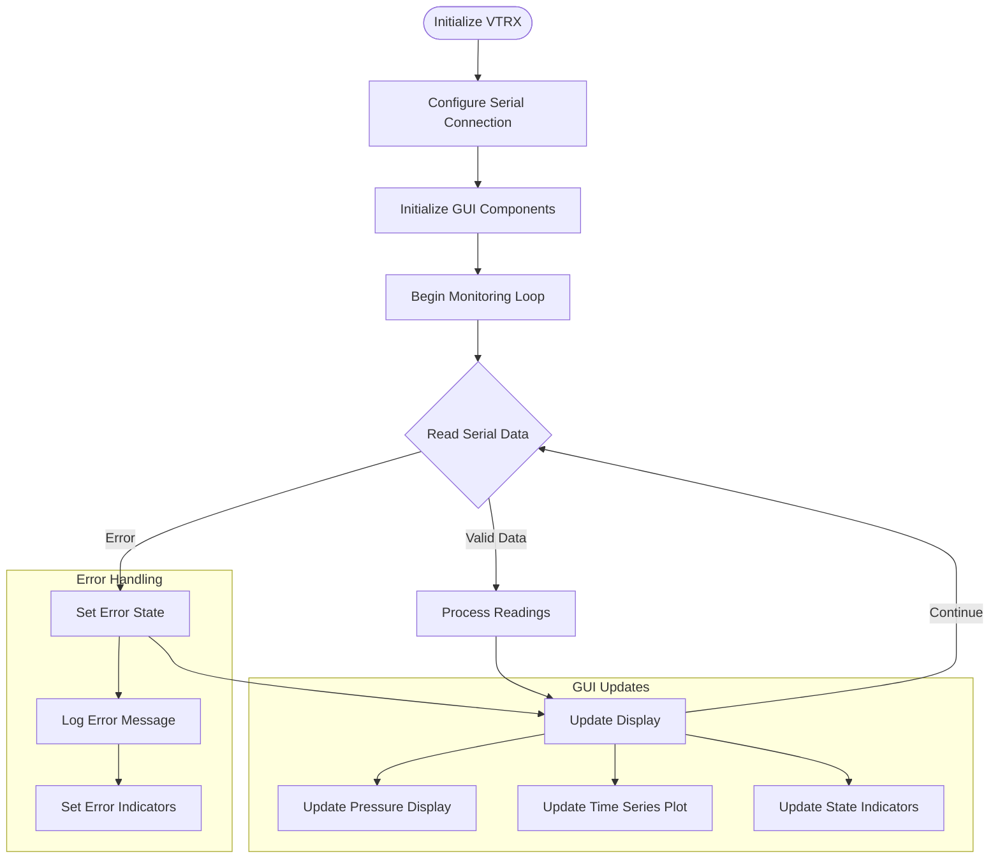

# VTRX Subsystem

## Overview

The VTRX (Vacuum Electronics) subsystem provides real-time monitoring and visualization of vacuum system pressure and component states. It interfaces with a microcontroller in the VTRX system and uses serial communication to track 972B pressure readings, valve states, and system safety conditions. It also consumes 902B readings from the separate MKS driver for remote logging.

## Key Components
### Hardware Interface
- Serial COM with VTRX chassis
- 9600 baud
- MKS 902B measurements supplied by `MKS902BDriver`

### Input serial Data Packet
Parser expects semicolon-separated string containing at least three fields:
1. pressure value (float)
2. raw pressure string (scientific notation)
3. switch states in binary format
4. Optional additional error messages

### Data Retention and Time Window
The subsystem maintains a rolling buffer of pressure readings with the following characteristics:
- Max history: 168 hours (1 week)
- Data points are automatically trimmed beyond this window

### GUI Elements
- Real-time 972B and 902B pressure displays
- 972B and 902B pressure plotting with a shared configurable time window
- Combined visible-data pressure bounds and a permanent sensor legend
- State indicator lights for system switches
- Error state visualization
- Plot save functionality with automatic timestamping

### 902B publication
- Fresh 902B measurements are published to the Web Monitor log and Supabase.
- A fresh, valid 972B pressure strictly below `1.0 mbar` suppresses 902B publication and clears the published value to `null`.
- A 972B pressure at or above `1.0 mbar` permits publication.
- A stale, disconnected, malformed, or otherwise unavailable 972B does not suppress an independently fresh 902B measurement.
- 902B measurements retain their own six-second freshness limit and are cleared when stale.
- The local 902B pressure box is hidden only while 902B publication is suppressed by a confirmed low 972B pressure.
- While the 902B box is hidden, the 972B label and pressure box are centered; the two-sensor layout returns when suppression ends.

### 902B graphing
- Every unsuppressed 902B queue item is plotted at the acquisition timestamp carried by that item.
- The latest item in each queue batch supplies the current 902B pressure display.
- Suppressed queue items are not added to graph history; points accepted before suppression remain until they leave the selected time window.
- The first accepted point after suppression begins a new indigo line segment so the suppressed interval remains visible as a gap.
- The Y-axis bounds include all positive 972B and 902B values visible in the selected time window.

Flowchart: 

```mermaid
flowchart TD
    Start([Initialize VTRX]) --> SerialSetup[Configure Serial Connection]
    SerialSetup --> GUISetup[Initialize GUI Components]
    
    GUISetup --> StartMonitor[Begin Monitoring Loop]
    
    StartMonitor --> ReadData{Read Serial Data}
    ReadData -->|Valid Data| ProcessData[Process Readings]
    ReadData -->|Error| HandleError[Set Error State]
    
    ProcessData --> UpdateGUI[Update Display]
    HandleError --> UpdateGUI
    
    UpdateGUI --> |Continue| ReadData
    
    subgraph Error Handling
        HandleError --> LogError[Log Error Message]
        LogError --> SetIndicators[Set Error Indicators]
    end
    
    subgraph GUI Updates
        UpdateGUI --> UpdatePressure[Update Pressure Display]
        UpdateGUI --> UpdatePlot[Update Time Series Plot]
        UpdateGUI --> UpdateStates[Update State Indicators]
    end
```
